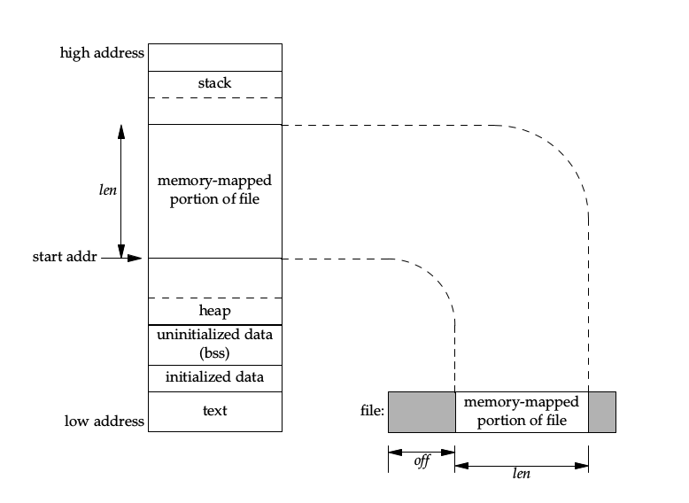

## 高级IO

### 非阻塞IO

对于可能使进程永远阻塞的系统调用，如果不想进程一直阻塞，可以将系统调用设为非阻塞：

* open时指定O_NONBLOCK标志；
* fcntl对一个打开的描述符设置O_NONBLOCK标志；

这样，如果系统调用无法满足要求，会立刻返回并设定相应错误标志。

### 记录锁

记录锁保证不会有多个进程同时修改一个文件的**同一区域**，设置记录锁的POSIX方法是通过fcntl：

* cmd为F_GETLK, F_SETLK, F_SETLKW, arg是指向flock结构的指针；

<!-- more -->

* flock结构如下：

    ~~~c
    struct flock{
        short l_type;   // F_RDLCK, F_WRLCK, F_UNLCK
        short l_whence; // SEEK_SET, SEEK_CUR, SEEK_END
        off_t l_start;  // 偏移量
        off_t l_len;    // 区域长度，0表示锁到EOF
        pid_t l_pid;    // 锁的持有者
    }
    ~~~

* 同一进程重复加锁会替换之前的锁；
* 锁与进程和文件都关联，进程终止锁全部释放，**而即使描述符引用计数大于1，只要任何一个描述符关闭，描述符引用文件的锁全部释放**，这是因为锁信息存放在v节点中，而锁信息并没有记录究竟是谁加的锁；
* fork不会继承锁，exec取决是否设置exec关闭标志；
* 在文件尾端加锁要注意；

### IO复用

#### select

~~~c
nt select(int nfds, fd_set *readfds, fd_set *writefds,
            fd_set *exceptfds, struct timeval *timeout);

void FD_CLR(int fd, fd_set *set);
int  FD_ISSET(int fd, fd_set *set);
void FD_SET(int fd, fd_set *set);
void FD_ZERO(fd_set *set);

int pselect(int nfds, fd_set *readfds, fd_set *writefds,
            fd_set *exceptfds, const struct timespec *timeout,
            const sigset_t *sigmask);
~~~

* nfds是最大fd加1；
* 每次调用要重新设置关心的描述符集；
* 描述符是否阻塞不影响select；
* timeout为NULL无限等待，等于0非阻塞；
* pselect时间更精确，可原子安装信号屏蔽字；
* select监听的描述符上限取决于fd_set类型的大小；

#### poll

~~~c
int poll(struct pollfd *fds, nfds_t nfds, int timeout);

int ppoll(struct pollfd *fds, nfds_t nfds,
    const struct timespec *tmo_p, const sigset_t *sigmask);

struct pollfd {
    int   fd;         /* file descriptor */
    short events;     /* requested events */
    short revents;    /* returned events */
};
~~~

* 和select本质一样，都是轮询，只是接口不同，基本没有上限；

### 异步IO

和同步IO相比，异步IO会替永远替进程完成所有的IO操作，然后才通知进程，而无论是阻塞IO、非阻塞IO、IO复用、信号驱动IO，都只是通知可以进行IO操作的方式不同，进程还是要自己把数据取出或写入。

### readv和writev

~~~c
ssize_t readv(int fd, const struct iovec *iov, int iovcnt);
ssize_t writev(int fd, const struct iovec *iov, int iovcnt);
ssize_t preadv(int fd, const struct iovec *iov, int iovcnt, off_t offset);
ssize_t pwritev(int fd, const struct iovec *iov, int iovcnt, off_t offset);
~~~

* 分散读、集中写。

### 存储映射IO

~~~c
void *mmap(void *addr, size_t length, int prot,
            int flags, int fd, off_t offset);

int mprotect(void *addr, size_t len, int prot);
int msync(void *addr, size_t length, int flags);
int munmap(void *addr, size_t length);
~~~

* mmap将一个磁盘文件映射到进程内存中；
* addr为映射起始地址，通常为0，代表由系统选择地址；
* fd是被映射的文件描述符，offset是偏移量，length是映射长度；
* prot是对映射区的保护要求，不能和fd打开模式冲突：
    * PROT_READ：可读；
    * PROT_WRITE：可写；
    * PROT_EXEC：可执行；
    * PROT_NONE：不可访问；
* flags是属性：
    * MAP_FIXED：映射地址必须是addr；
    * MAP_SHARED：允许进程修改映射区；
    * MAP_PRIVATE：对映射区的写操作会创建一个进程的副本；
* 映射区域如下：

    
* mprotect可以更改映射区权限；
* msync类似fsync；
* munmap解除映射；
