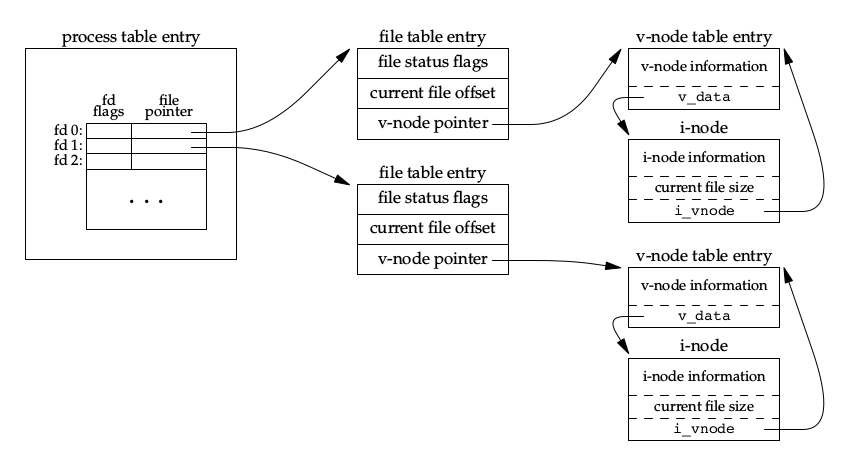
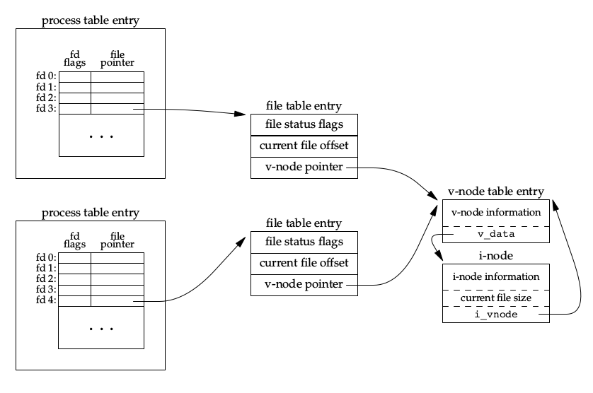
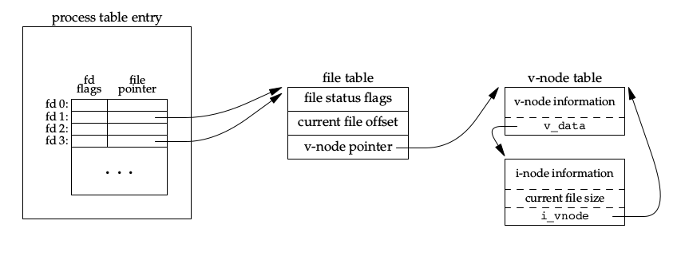
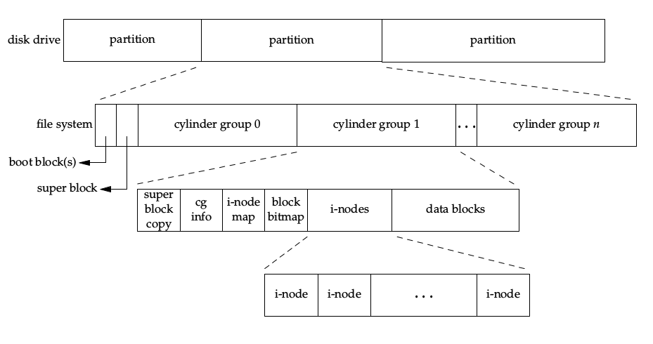
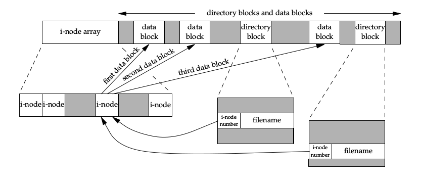

## 文件IO

### 相关函数

~~~c
// 返回的文件描述符一定是最小的未用描述符数值
// at函数从fd相对路径打开文件
// at函数可避免TOCTTOU错误
int open(const char *path, int oflag, ...);
int openat(int fd, const char *path, int oflag, ...);
 
// 等同于open(path, O_WRONLY|O_CREAT|O_TRUNC, mode);
int creat(const char *path, mode_t mode);

// 关闭文件的同时会释放文件上的所有记录锁
int close(int fd);

// 设置文件偏移量，只更改偏移量，不引起I/O操作
off_t lseek(int fd, off_t offset, int whence);

// 返回读/写字节数
ssize_t read(int fd, void *buf, size_t nbytes);
ssize_t write(int fd, void *buf, size_t nbytes);

// 相当于先lseek后read/write，但是是原子操作
ssize_t pread(int fd, void *buf, size_t nbytes, off_t offset);
ssize_t pwrite(int fd, void *buf, size_t nbytes, off_t offset);
~~~

<!-- more -->

### **文件共享**

内核使用三种数据结构表示打开文件：

1. 进程表中的每一个进程都有一个记录项，这个记录项中有一张打开文件描述符表，每个文件描述符占用一项；
2. 内核为所有打开的文件维护一张打开文件表，其中包含：
    * 文件状态标志；
    * 当前文件偏移量；
    * 指向v节点的指针；
3. 每个打开文件都有一个v节点，v节点包含了文件的一系列信息，直接和硬盘上的数据相关；

~~~c
// 复制一个现有的文件描述符
// dup返回当前可用的最小数值描述符
// dup2保证返回的描述符是fd2的数值
int dup(int fd);
int dup2(int fd, int fd2);
~~~

### 刷新缓冲区

~~~c
// 将缓冲区排入写队列，不等待实际IO完成就返回
void sync(void);

// 类似sync，但实际IO完成才返回
// 保证数据一定写到了硬盘上
// 更新文件的数据和属性
int fsync(int fd)

// 类似fsync，但只更新文件数据部分
int fdatasync(int fd)
~~~

### 其他

~~~c
// 改变打开文件的属性：
// 复制已有描述符(F_DUPFD)
// 获取/设置文件描述符标志(F_GETFDM, F_SETFD)
// 获取/设置文件状态标志(F_GETFL, F_SETFL)
// 获取/设置异步I/O所有权(F_GETOWN, F_SETOWN)
// 获取/设置记录锁(F_GETLK, F_SETLK)
int fcntl(int fd, int cmd, ...);

// 杂项IO操作
int ioctl(int fd, int request, ...);
~~~

关于/dev/fd：打开/dev/fd/n等同复制描述符n，类似dup。

如果使用追加标志打开了一个文件用来读写，lseek是有效的，因此可以从任何位置读，但写时，由于追加标志，文件偏移量会自动变为文件尾，无法在任何位置写:(

## 文件和目录

### 文件类型

* 普通文件
* 目录文件
* 块特殊文件
* 字符特殊文件
* FIFO
* 套接字
* 符号链接

### 文件权限

设置用户ID和设置组ID：通常执行程序文件时，进程有效UID就是实际UID，但如果设置了*设置用户ID位*，进程的有效UID会变为文件所有者的UID，这可以让普通用户也可以运行需要root权限的程序，设置组ID同理。

文件权限：

* 用户(U)rwx，组(G)rwx，其他(O)rwx；
* 目录的r权限允许获取目录中所有文件的列表，目录的x权限允许搜索目录，于是目录的x位又称搜索位；
* 进程访问文件进行访问权限测试时，按照 超级用户->UID->GID->其他 的顺序检查，任何一项满足则停止检查；

### 文件系统

* 目录项中包括文件名，i节点编号；
* i节点中包括除了文件名和i节点编号的所有文件信息；
* 每个i节点都有一个链接计数，这就是硬链接的个数；
* 软链接是一种文件，占用一个数据块，类似win快捷方式；
* 由于两个文件系统i节点编号不唯一，可知硬链接不能跨文件系统；
* 同一文件系统下移动重命名只需改变目录项即可，原文件i节点编号不改变；
* 只有当i节点链接计数为0且无进程打开这个文件时，i节点数据才会被释放；
