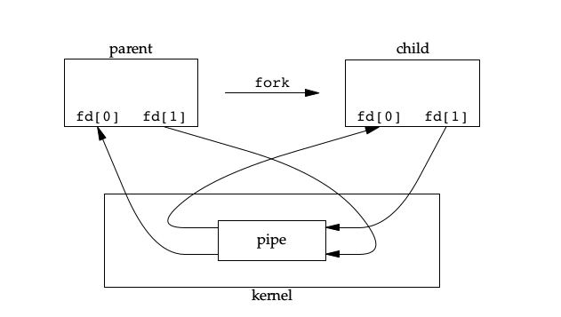
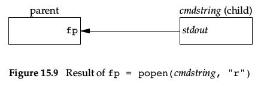
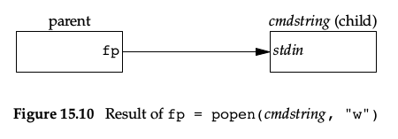
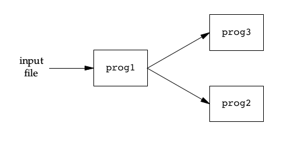
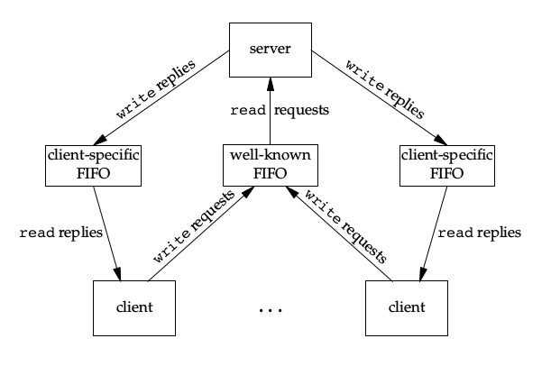
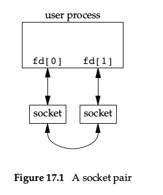
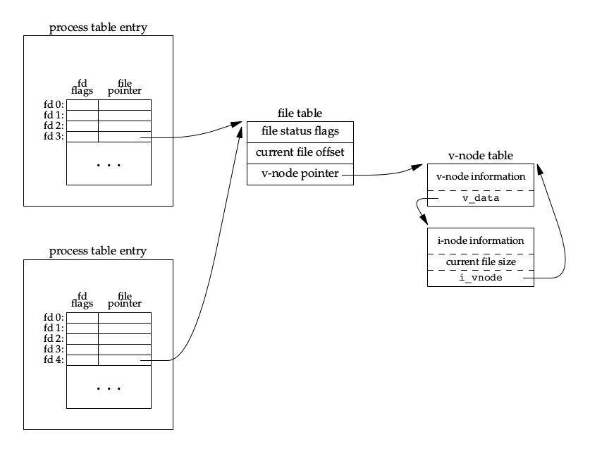

## 进程间通信

### 管道

~~~c
int pipe(int fd[2]);
~~~

* 管道是半双工的，且只能在有公共祖先的两个进程之间使用；
* fd[0]可读，fd[1]可写；
* 通常用法是先pipe，然后fork，这样父子进程就可以通信：

    

* 读一个写端已关闭的管道，在所有数据都读取后，read返回0，表示文件结束；
* 写一个读端已关闭的管道，会产生SIGPIPE，write返回-1，errno设置为EPIPE；
* 若多个进程同时写管道，且写字节数超过PIPE_BUF，则数据可能相互交叉；

<!-- more -->

~~~c
FILE *popen(const char *command, const char *type);
int pclose(FILE *stream);
~~~

* 这是标准IO库提供的函数；
* popen先创建管道，然后fork，根据type决定对管道的处理，然后exec command，最后返回一个FILE指针：

    
    
    

* pclose关闭标准IO流，返回command终止状态；

#### 协同进程

当进程A既读取进程B的输出，同时也产生进程B的输入时，就称进程A是进程B的协同进程，因为进程A的输入和输出都是在为进程B服务。

### FIFO

~~~c
int mkfifo(const char *pathname, mode_t mode);
int mkfifoat(int dirfd, const char *pathname, mode_t mode);
~~~

* 也被称为命名管道，可以在不相关的两个进程间使用，半双工；
* FIFO是一种文件类型，创建类似创建文件；
* mkfifo类似open，mkfifoat类似openat；
* 使用open来打开一个FIFO：
    * 阻塞打开(不指定O_NONBLOCK)时，只读open阻塞至其他进程写open为止，反之亦然；
    * 非阻塞打开(指定O_NONBLOCK)时，只读open立刻返回，而只写open时若没有其他进程读open，则出错返回-1，并设置errno为ENXIO；
    * 类似管道，写一个无进程读的FIFO会产生SIGPIPE，当FIFO最后一个写进程关闭FIFO时，为FIFO读进程产生一个EOF；
* FIFO可以被多个进程写，如果不希望写数据交叉，应根据PIPE_BUF大小考虑原子写最大数据量；
* FIFO的用途：
    * shell命令将数据从一条管道传到另一条，且无需创建中间临时文件:

        ~~~shell
        mkfifo fifo1
        prog3 < fifo1 &
        prog < infile | tee fifo1 | prog2
        ~~~

        

    * C-S应用程序中，FIFO用作汇聚点在C和S两者之间传递数据：

        

### XSI IPC

消息队列，信号量，共享存储，这三种IPC都在内核中被一个非负整数标识符引用，而由于这个标识符是IPC对象的内部命名，需要提供一个外部命名供进程引用，因此每个IPC对象都与一个键关联，键是IPC对象的外部名。

如何让多个进程在同一IPC结构上汇聚？

1. 可以指定IPC_PRIVATE创建一个新IPC结构，然后保存标识符供进程使用；
2. 在公共文件中定义一个公认键，但要处理键已经关联的情况；
3. 使用ftok产生一个键值，然后用这个值创建IPC结构：

    ~~~c
    key_t ftok(const char *pathname, int proj_id);
    ~~~

msgget, semget, shmget都有类似的参数: key和flag：

* 如果要创建一个IPC结构，则key应该是IPC_PRIVATE或者与当前IPC结构无关且指定IPC_CREAT标志位；
* 如果要引用一个现有IPC结构，key必须等于创建时的key值，且不能指定IPC_CREAT；
* IPC_PRIVATE总是用来创建新IPC结构的，为了引用用IPC_PRIVATE创建的IPC结构，必须知道其相关的标识符，然后在其他IPC调用中跳过get函数，使用此标识符；

每个IPC结构都关联了一个ipc_perm结构，其中包含了IPC结构的各种权限设置。

XSI IPC的优缺点：

* IPC结构是在系统范围内作用的，没有引用计数，即使没有进程使用它，只要不显式读取或删除，它就会一直留在系统里；
* 这些IPC结构在文件系统里没有名字，操作不便，也无法对其进行IO复用(select和poll)；

### 消息队列

~~~c
struct msqid_ds {
	struct ipc_perm msg_perm;
	struct msg *msg_first;		/* first message on queue,unused  */
	struct msg *msg_last;		/* last message in queue,unused */
	__kernel_time_t msg_stime;	/* last msgsnd time */
	__kernel_time_t msg_rtime;	/* last msgrcv time */
	__kernel_time_t msg_ctime;	/* last change time */
	unsigned long  msg_lcbytes;	/* Reuse junk fields for 32 bit */
	unsigned long  msg_lqbytes;	/* ditto */
	unsigned short msg_cbytes;	/* current number of bytes on queue */
	unsigned short msg_qnum;	/* number of messages in queue */
	unsigned short msg_qbytes;	/* max number of bytes on queue */
	__kernel_ipc_pid_t msg_lspid;	/* pid of last msgsnd */
	__kernel_ipc_pid_t msg_lrpid;	/* last receive pid */
};

int msgget(key_t key, int msgflag);
int msgctl(int msqid, int cmd, struct msqid_ds *buf);
int msgsnd(int msqid, const void *msgp, size_t msgsz, int msgflg);
ssize_t msgrcv(int msqid, void *msgp, size_t msgsz, long msgtyp, int msgflg);

struct msgbuf {
    long mtype;       /* message type, must be > 0 */
    char mtext[1];    /* message data */
};
~~~

* 消息队列是消息的链表，存储在内核中，由队列ID标识；
* 每个队列都和一个msqid_ds结构关联，此结构描述了队列的当前状态；
* msgget创建或引用一个队列，返回队列ID；
* msgctl对队列执行各种操作：
    * IPC_STAT：获取队列的msqid_ds结构并存放在buf中；
    * IPC_SET：将buf中的msg_perm.uid, msg_perm.gid, msg_perm.mode, msg_qbytes赋予队列相关结构中；
    * IPC_RMID：删除消息队列和消息队列中的所有数据，删除立刻生效，之后对此队列进行操作将得到EIDRM错误；
* msgsnd将数据放到消息队列中：
    * msgp指向一个msgbuf结构，mtext的长度为msgsz；
    * msgflg可以是IPC_NOWAIT，即非阻塞；
    * msgsnd返回成功时会更新相关的msqid_ds结构；
* msgrcv从消息队列中获取数据：
    * msgp指向一个msgbuf结构，mtext指向缓冲区，大小为msgsz；
    * msgtyp指定想取的消息：
        * ==0：返回队列第一个消息；
        * \>0：返回队列中mtype为msgtyp的消息；
        * \<0：返回队列中mtype \<= msgtyp绝对值的消息，先取最小的；
    * msgflg可以为IPC_NOWAIT，即非阻塞；
    * msgrcv返回成功时会更新相关的msqid_ds结构；

### 信号量

~~~c
struct semid_ds {
	struct ipc_perm	sem_perm;		/* permissions .. see ipc.h */
	__kernel_time_t	sem_otime;		/* last semop time */
	__kernel_time_t	sem_ctime;		/* last change time */
	struct sem	*sem_base;		/* ptr to first semaphore in array */
	struct sem_queue *sem_pending;		/* pending operations to be processed */
	struct sem_queue **sem_pending_last;	/* last pending operation */
	struct sem_undo	*undo;			/* undo requests on this array */
	unsigned short	sem_nsems;		/* no. of semaphores in array */
};

int semget(key_t key, int nsems, int semflg);
int semctl(int semid, int semnum, int cmd, ...);
int semop(int semid, struct sembuf *sops, size_t nsops);

struct sembuf {
	unsigned short  sem_num;	/* semaphore index in array */
	short		sem_op;		/* semaphore operation */
	short		sem_flg;	/* operation flags */
};
~~~

* 信号量是一个计数器，用于控制多个进程对共享数据对象的访问；
* XSI信号量有3种特性：
    * 信号量必须是一个或多个信号量的集合，创建时要指定数量；
    * 信号量的创建和初始化是独立的，这意味着无法原子性的创建并初始化信号量集；
    * 即使没有进程使用信号量，信号量依然存在，undo可以解决这个问题；
* 每个信号量都和一个semid_ds结构关联，此结构描述了信号量的当前状态；
* semget创建或引用一个信号量，返回信号量ID，nsems是集合中的信号量数，引用信号量则应设置为0；
* semctl对队列进行各种操作，类似msgctl，不过选项更多；
* semop对信号量进行操作，操作取决于sembuf数组：
    * sem_num指定对哪个信号量操作；
    * sem_op为正意味着释放资源，为负意味着获取资源，为0意味着调用进程希望等待到该信号量变为0；
    * sem_flg可以为IPC_NOWAIT，意味着非阻塞；
    * sem_flg可以指定SEM_UNDO标志，之后分配资源时内核会记住信号量调整量，这样当进程终止时，如果进程没有对信号量进行调整，内核会对相应信号量进行调整；
* semop是个原子操作，操作数组要么全执行，要么都不执行；

### 共享存储

~~~c
struct shmid_ds {
	struct ipc_perm		shm_perm;	/* operation perms */
	int			shm_segsz;	/* size of segment (bytes) */
	__kernel_time_t		shm_atime;	/* last attach time */
	__kernel_time_t		shm_dtime;	/* last detach time */
	__kernel_time_t		shm_ctime;	/* last change time */
	__kernel_ipc_pid_t	shm_cpid;	/* pid of creator */
	__kernel_ipc_pid_t	shm_lpid;	/* pid of last operator */
	unsigned short		shm_nattch;	/* no. of current attaches */
	unsigned short 		shm_unused;	/* compatibility */
	void 			*shm_unused2;	/* ditto - used by DIPC */
	void			*shm_unused3;	/* unused */
};

int shmget(key_t key, size_t size, int shmflg);
int shmctl(int shmid, int cmd, struct shmid_ds *buf);
void *shmat(int shmid, const void *shmaddr, int shmflg);
int shmdt(const void *shmaddr);
~~~

* 共享存储允许多个进程共享一个给定的存储区，这是最快的一种IPC，因为不需要在各个进程之间进行拷贝，但是需要同步；
* mmap就是共享存储的一种形式，只不过mmap映射的文件真实存在，XSI共享存储是内存的匿名段；
* 每个共享存储段都和一个shmid_ds结构关联，此结构描述了共享存储段的当前状态；
* shmget创建或引用一个共享存储段，size为共享存储段的大小，引用时应指定为0；
* shmctl对共享存储段进行各种操作，类似msgctl；
* shmat将获取的共享存储段连接到进程的地址空间中，如果shmaddr为0，则由内核选择连接地址，非0则连接到指定地址；shmat返回实际连接的地址；
* shmat中，如果shmflg为SHM_RDONLY，则以只读方式连接，否则以读写方式连接；
* shmdt将共享存储段与进程分离，但并不删除共享存储段，应以IPC_RMID调用shmctl才能删除；

#### /dev/zero的存储映射

对/dev/zero的存储映射将创建一个未命名的存储区，长度为mmap的第二个参数并向上取整为系统页长，存储区初始化为0，可以用来在有共同祖先的进程间充当共享存储区。

也可以在mmap中指定MAP_ANON标志并将fd指定为-1来进行匿名存储映射。

### POSIX信号量

~~~c
sem_t *sem_open(const char *name, int oflag,... /*mode_t mode, unsigned int value*/);
int sem_close(sem_t *sem);
int sem_unlink(const char *name);

int sem_wait(sem_t *sem);
int sem_trywait(sem_t *sem);
int sem_timedwait(sem_t *sem, const struct timespec *abs_timeout);
int sem_post(sem_t *sem);

int sem_init(sem_t *sem, int pshared, unsigned int value);
int sem_destroy(sem_t *sem);
int sem_getvalue(sem_t *sem, int *sval);
~~~

* sem_open创建或引用一个现有的命名信号量，创建时要指定O_CREAT标志并提供mode权限参数和value信号量初始值，引用只需name并指定oflag为0，sem_open返回指向信号量的指针；
* sem_close释放信号量相关的资源，但并不影响信号量状态；
* sem_unlink销毁一个命名信号量；
* sem_*wait对信号量进行减一操作；
* sem_post对信号量进行增一操作；
* 如果想要使用未命名信号量，声明一个sem_t变量并用sem_init初始化，用sem_destroy销毁；
* sem_getvalue获取信号量的值，注意，返回的值不一定是信号量的当前值，因为获取值后信号量的值可能已经变了；

### 套接字

套接字是一种网络IPC，当然本地也可以用，但效率不如其他专用于本地的IPC高，详情见UNP笔记。

### UNIX域套接字

UNIX域套接字的关键在于可以传递文件描述符，它类似网络套接字，不过只用于本地。

#### 匿名UNIX域套接字

~~~c
int socketpair(int domain, int type, int protocol, int sv[2]);
~~~

* 创建一对匿名相互连接的UNIX域套接字，类似全双工管道：

    

#### 命名UNIX域套接字

类似绑定因特网域套接字，只不过地址应该是一个文件系统的路径名，且此文件不应该存在。

#### 传递文件描述符

传递文件描述符不是简单地传递一个数值，在传递过程中，文件描述符会被复制，文件的引用计数也会加一，而描述符编号也通常是不同的，类似于dup：

为了使用UNIX域套接字传递文件描述符，要调用sendmsg和recvmsg函数，指定msghdr结构中的msg_control和msg_controllen参数：

~~~c
struct msghdr {
    void         *msg_name;       /* optional address */
    socklen_t     msg_namelen;    /* size of address */
    struct iovec *msg_iov;        /* scatter/gather array */
    size_t        msg_iovlen;     /* # elements in msg_iov */
    void         *msg_control;    /* ancillary data, see bel*/
    size_t        msg_controllen; /* ancillary data buffer l*/
    int           msg_flags;      /* flags (unused) */
};

struct cmsghdr {
    socklen_t     cmsg_len;       /* data byte count, including header */
    int           cmsg_level;     /* originating protocol */
    int           cmsg_type;      /* protocol-specific type */
    /* followed by the actual control message data */ 
}

/*cmsg_len=CMSG_LEN(nbytes);
  cmsg_level=SOL_SOCKET;
  cmsg_type=SCM_RIGHTS; */
~~~

