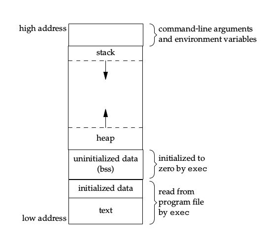
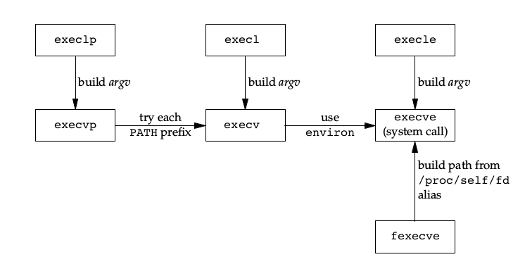
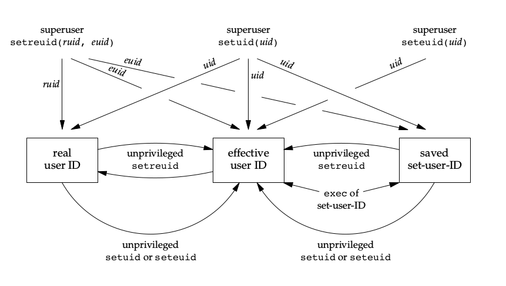
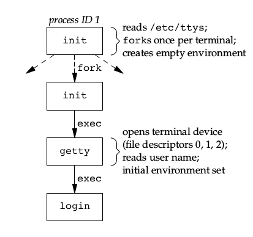
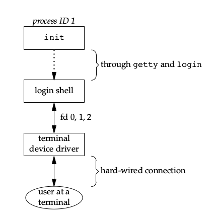
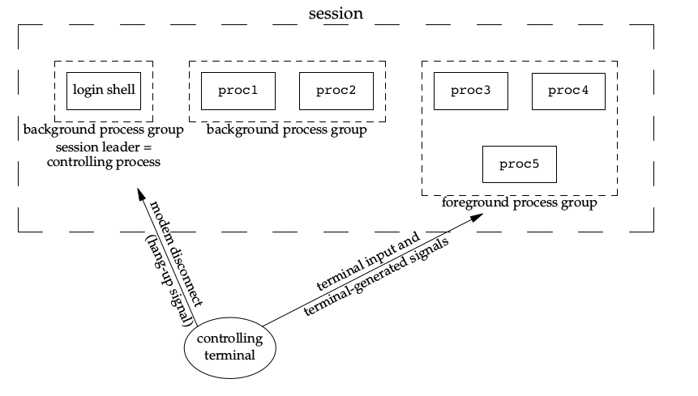
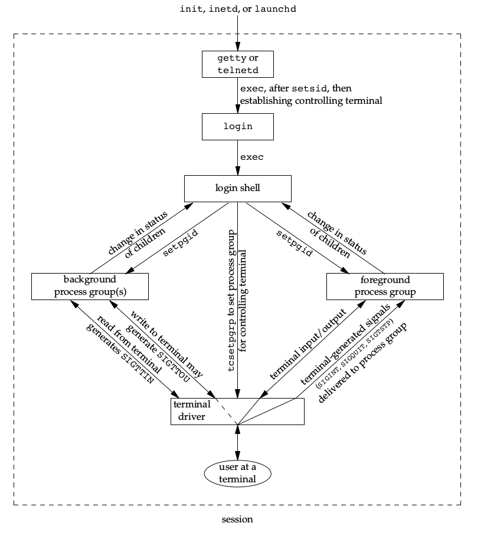

## 进程环境

### 程序的启动

内核执行C程序时，先调用启动例程，然后可执行程序文件将启动例程设置为起始地址，启动例程然后从内核获得命令行参数和环境变量，类似下面这样调用main函数：

~~~c
exit(main(argc, argv));
~~~

### 退出函数

~~~c
void exit(int status);
void _Exit(int status);
void _exit(int status);
~~~

这三个函数的区别：

* exit()会对标准IO进行清洗，关闭所有IO流，并调用注册在atexit和on_exit里的函数（调用顺序与注册顺序相反，可以重复注册），然后调用_exit()。
* _exit()直接返回内核，清理内存和进程。
* _Exit()和_exit()等价，只不过前者是标准IO库里的，后者是系统调用。
<!-- more -->

### **C程序存储空间布局**

* 正文段(text)：机器指令部分，只读，存放在可执行文件中；
* 初始化数据段：包括了程序中已初始化好的全局变量或静态变量，存放在可执行文件中；
* 未初始化数据段(bss)：未初始化的全局变量或静态变量，exec时初始化为0，并不存放在磁盘上；
* 堆(heap)：动态分配区；
* 栈(stack)：局部变量和函数调用区；
* 命令行参数和环境变量；
* 栈向低地址增长，堆向高地址增长，如图可知，这样能解决堆和栈大小问题，最大化利用空间。

### 存储空间动态分配

~~~c
void *malloc(size_t size);
void *calloc(size_t nobj, size_t size);
void *realloc(void *ptr, size_t newsize);
void free(void *ptr);
~~~

### 环境变量

全局变量environ是环境变量表，可直接访问此数组或者用getenv()，putenv()，setenv()，unsetenv()来访问和修改环境变量。

修改环境表时，删除不会有什么问题，但添加和修改的话，因为环境表是放在进程地址空间的顶部的，低地址又是栈空间，大小无法改变，这时就需要堆中的空间了。

### 非局部跳转

~~~c
int setjmp(jmp_buf env);
void longjmp(jmp_buf env, int val);
~~~

这两个函数可以保存和恢复栈中信息来达到局部跳转的作用，但要注意，自动变量和寄存器变量的值在调用longjmp后是不确定的，定义volatile属性可以解决这个问题。

## 进程控制

### **fork**

~~~c
pid_t fork(void);
~~~

* fork函数调用一次，返回两次：
    * 父进程返回值为子进程PID；
    * 子进程返回值为0；
* 子进程基本是父进程的副本，数据空间，堆，栈全部复制，仅共享正文段；
* 为了性能，有写时复制技术；
* 子进程中的文件描述符和父进程共享文件表项，类似dup；
* 子进程不继承文件锁，未处理闹钟清空，未处理信号集设为空集；

~~~c
pid_t vfork(void);
~~~

* vfork创建的新进程目的是exec一个新程序；
* 子进程不完全复制父进程，在exec前共享父进程空间；
* 可以提高效率，但一定不要修改数据；
* vfork保证子进程优先运行；

### 孤儿进程和僵死进程

* 子进程终止后，会留下一些信息(pid, 终止状态, cpu时间等)，父进程调用wait或waitpid可以得到这些信息，在父进程还没有wait之前，这些终止的进程就称为僵死进程；
* 如果子进程的父进程没有wait就终止，活动的子进程就变为孤儿进程，被init收养；
* 僵死进程会占用空间，对系统有害；
* init一定会wait子进程，因此处理僵死进程的一个办法是kill掉他的父进程；
* 如果一个进程fork一个子进程，既不希望它等待子进程，也不希望子进程僵死至父进程终止的话，可以fork两次，第一次fork的子进程直接终止，使父进程不用等待子进程终止，也使真正的子进程成为孤儿进程，防止其长时间僵死。

### **wait和waitpid**

~~~c
pid_t wait(int *statloc);
pid_t waitpid(pid_t pid, int *statloc, int options);
~~~

* wait阻塞直至有一个子进程终止，没有子进程则出错返回；
* 对于waitpid：
    * pid == -1：和wait等价；
    * pid \> 0：等待进程ID等于pid的子进程；
    * pid == 0：等待组ID等于调用进程组ID的任一子进程；
    * pid \< -1：等待组ID等于pid绝对值的任一子进程；
    * WNOHANG选项提供非阻塞wait；
* 还有waitid, wait3和wait4函数，提供了一些附加参数。

### **exec**

~~~c
int execl(const char *path, const char *arg, ... /* (char *) NULL */);
int execv(const char *path, char *const argv[]);
int execle(const char *path, const char *arg, ... /* (char *) NULL, char *const envp[] */);
int execve(const char *path, const *const argv[], char *const envp[]);
int execlp(const char *file, const char *arg, ... /* (char *) NULL */);
int execvp(const char *file, char *const argv[]);
int execvpe(const char *file, char *const argv[], char *const envp[]);
int fexecve(int fd, char *const argv[], char *const envp[]);
~~~

* l:list, v:vector, e:envp, p:PATH, f:fd；
* file是在PATH环境变量目录中找可执行文件；
* 执行exec后，新程序继承文件锁、信号屏蔽字、未处理信号、资源限制等，文件描述符取决于FD_CLOEXEC标志是否打开；
* 以上exec的关系如图：
    

### 更改用户ID相关的函数

### 解释器文件

解释器文件是文本文件，第一行是：

~~~
#! pathname [optional-argument]
~~~

内核exec的是pathname指向的文件，然后用此程序解释文件剩下的内容。

### system函数

~~~c
int system(const char *cmdstring);
~~~

* 执行cmdstring命令；
* 实现大概是fork，execshell程序，waitpid；

## 进程关系

### 终端登录

### 进程关系

* 进程组：一个或多个进程的集合，有一个组长进程，组长进程的PID就是GID。
* 孤儿进程组：进程组内每个成员的父进程要么是组内成员，要么不是该组所属会话的成员。
* 会话：一个或多个进程组的集合，可以将会话首进程的PID视为SID。
    * 会话可以有一个控制终端；
    * 与控制终端建立连接的会话首进程成为控制进程；
    * 会话中的进程组可分为一个前台进程组和一个或多个后台进程组；
    * 以上特性如图：
  
        

### 作业控制

## 守护进程

守护进程没有控制终端，通常常驻系统后台。

### 如何编写守护进程

* 调用umask将文件创建屏蔽字设置为某个特定值；
* 调用fork，父进程exit，保证子进程不是组长进程；
* 调用setsid，创建新会话；
* 再次fork，防止子进程获得控制终端；
* 更改工作目录，关闭不需要文件描述符；
* 在0, 1, 2上打开/dev/null防止使用这些描述符的函数出错。

### 守护进程日志信息

~~~c
void openlog(const char *ident, int option, int facility);
void syslog(int priority, const char *format, ...);
void closelog(void);
int setlogmask(int maskpri);
~~~

### 守护进程惯例

* 为了保证只有一个守护进程实例运行，可能使用锁文件，该文件通常命名为name.pid存储在/var/run目录下，内容是守护进程pid；
* 守护创建配置文件命名为name.conf放在/etc目录下；
* 既然守护进程没有控制终端，那么可以利用SIGHUP来进行某些操作。