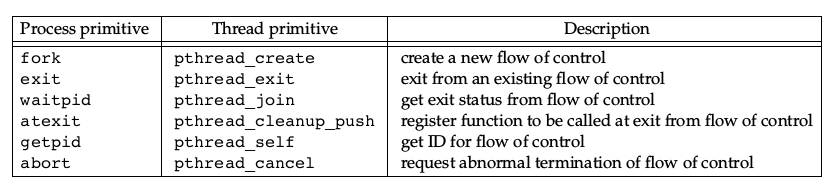
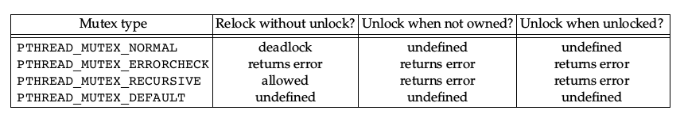

## 线程

### 线程特点

* 可以简化异步代码；
* 共享进程资源；
* 自身仍有线程ID，寄存器，栈，调度信息，信号屏蔽字，errno，线程私有数据；
* 需要同步，一个线程异常会导致整个进程异常；

### 线程创建

~~~c
int pthread_equal(pthread_t tid1, pthread_t tid2);
pthread_t pthread_self(void);

int pthread_create(pthread_t *thread, const pthread_attr_t *attr,
                void *(*start_routine) (void *), void *arg);
~~~

* tid存入thread指向空间；
* attr定义线程属性：
    * 初始化一个属性对象传入；
    * 通过pthread_attr_setdetachstate()设置detachstate属性可使线程创建时就是detach态；
* 线程从start_routine地址开始运行，参数为arg。

<!-- more -->

### 线程终止

线程终止方式：
* 简单return；
* 被其他线程pthread_cancel；
* 自身pthread_exit。

~~~c
void pthread_exit(void *rval_ptr);
int  pthread_join(pthread_t thread, void **rval_ptr);
int  pthread_cancel(pthread_t tid);
void pthread_cleanup_push(void (*routine)(void *), void *arg);
void pthread_cleanup_pop(int execute);

int  pthread_detach(pthread_t tid);
~~~

* pthread_cancel仅提出请求；
* detach态的线程终止后资源立刻被回收；
* 和进程的对比：

    

### **线程同步**

#### 死锁

* 互斥：一个资源只能给一个进程使用；
* 不可剥夺：进程获得的资源在使用完毕前不可被其它进程剥夺；
* 请求和保持：进程占用已获得的资源，并且同时申请新的资源；
* 循环等待：存在一个资源等待循环，使得每个进程都无法满足条件；

#### 互斥量

~~~c
int pthread_mutex_init(pthread_mutex_t *restrict mutex,
            const pthread_mutexattr_t *restrict attr);
int pthread_mutex_destroy(pthread_mutex_t *mutex);

int pthread_mutex_lock(pthread_mutex_t *mutex);
int pthread_mutex_trylock(pthread_mutex_t *mutex);
int pthread_mutex_timedlock(pthread_mutex_t *restrict mutex,
int pthread_mutex_unlock(pthread_mutex_t *mutex);
            const struct timespec *restrict tsptr);
~~~

* 互斥量就是一把锁，使用前加锁，使用后解锁，一把锁只能被一个线程拥有，其它想要加锁的线程只能等待；
* 静态分配互斥量可用PTHREAD_MUTEX_INITIALIZER初始化；
* 属性：
    * 进程共享属性：允许多个进程利用互斥量同步；
    * 健壮属性：与多个进程使用互斥量有关；
    * 类型属性：
        
        

#### 读写锁

~~~c
int pthread_rwlock_init(pthread_rwlock_t *restrict rwlock,
            const pthread_rwlockattr_t *restrict attr);
int pthread_rwlock_destroy(pthread_rwlock_t *rwlock);

int pthread_rwlock_rdlock(pthread_rwlock_t *rwlock);
int pthread_rwlock_tryrdlock(pthread_rwlock_t *rwlock);
int pthread_rwlock_timedrdlock(pthread_rwlock_t *restrict rwlock,
            const struct timespec *restrict tsptr);
int pthread_rwlock_wrlock(pthread_rwlock_t *rwlock);
int pthread_rwlock_trywrlock(pthread_rwlock_t *rwlock);
int pthread_rwlock_timedwrlock(pthread_rwlock_t *restrict rwlock,
            const struct timespec *restrict tsptr);
int pthread_rwlock_unlock(pthread_rwlock_t *rwlock);
~~~

* 类似互斥量，但是读写锁允许多个读者，只允许一个写者；
* 适合读频率大于写频率的数据；
* 为了避免写者饥饿，在写锁阻塞后，后来的读锁可能会阻塞；
* 属性：
    * 进程共享属性；

#### 条件变量

~~~c
int pthread_cond_init(pthread_cond_t *restrict cond,
            const pthread_condattr_t *restrict attr);
int pthread_cond_destroy(pthread_cond_t *cond);

int pthread_cond_wait(pthread_cond_t *restrict cond,
            pthread_mutex_t *restrict mutex);
int pthread_cond_timedwait(pthread_cond_t *restrict cond,
            pthread_mutex_t *restrict mutex,
            const struct timespec *restrict tsptr);

int pthread_cond_signal(pthread_cond_t *cond);
int pthread_cond_broadcast(pthread_cond_t *cond);
~~~

* 条件变量允许线程以无竞争的方式等待特定的条件发生；
* 条件变量和互斥量一起使用，条件由互斥量保护；
* pthread_cond_wait调用时进行条件检查和解锁互斥量，返回时再次锁住互斥量；
* 由于条件改变后到等待线程锁住互斥量之间条件可能改变，应在pthread_cond_wait返回后再次检查条件；
* 属性：
    * 进程共享属性；
    * 时钟属性：控制超时参数使用哪个时钟；

#### 自旋锁

~~~c
int pthread_spin_init(pthread_spinlock_t *lock, int pshared);
int pthread_spin_destroy(pthread_spinlock_t *lock);

int pthread_spin_lock(pthread_spinlock_t *lock);
int pthread_spin_trylock(pthread_spinlock_t *lock);
int pthread_spin_unlock(pthread_spinlock_t *lock);
~~~

* 自旋锁类似互斥量，但它不阻塞线程，而是在获得锁之前一直忙等；
* 如果持锁时间短，且不希望线程在重新调度上花太多时间，可以用自旋锁；
* 自旋锁通常用于底层，内核中自旋锁可以阻塞中断，防止死锁；

#### 屏障

~~~c
int pthread_barrier_init(pthread_barrier_t *restrict barrier,
            const pthread_barrierattr_t *restrict attr,
            unsigned int count);
int pthread_barrier_destroy(pthread_barrier_t *barrier);

int pthread_barrier_wait(pthread_barrier_t *barrier);
~~~

* 屏障可以协调多个线程并行工作，允许合作线程共同到达某一点后再继续向后工作；
* 屏障可以重用，但计数一旦初始化，就无法改变；
* 属性：
    * 进程共享属性；

### 线程取消选项

影响线程响应pthread_cancel的行为。

### 线程与信号

虽然每个线程有各自的信号屏蔽字，但它们共享信号处理函数，并且在线程中与信号有关的函数如下：

~~~c
int pthread_sigmask(int how, const sigset_t *restrict set,
            sigset_t *restrict oset);
int sigwait(const sigset_t *restrict set, int *restrict signop);
int pthread_kill(pthread_t thread, int signo);
~~~

* sigwait阻塞进程，等待set中的信号到来，然后将信号从等待队列中移除；
* 在sigwait之前，应将set中的所有信号阻塞；
* 利用sigwait，可以将想阻塞的信号加到每个线程中，然后创建一个专门的线程处理信号，从而简化代码中的信号处理；
* alarm定时器是进程资源，所有线程共享；

### 线程与fork

多线程进程fork的主要问题在于，子进程内部只存在一个线程，这个线程是父进程中调用fork的线程，同时子进程会继承父进程所有的锁，但子进程中并没有占用锁的线程，如何清理锁是个问题：

* 如果立刻exec则无需考虑这个问题，exec后旧的空间被丢弃，锁状态无所谓，但在exec前只能调用异步信号安全的函数；
* 如果不exec，可以通过pthread_atfork()清楚锁状态；

### 线程与IO

~~~c
ssize_t pread(int fd, void *buf, size_t count, off_t offset);
ssize_t pwrite(int fd, const void *buf, size_t count, off_t offset);
~~~

* 由于线程共享文件描述符，pread和pwrite提供的原子(lseek+read/write)操作是很有用的；
