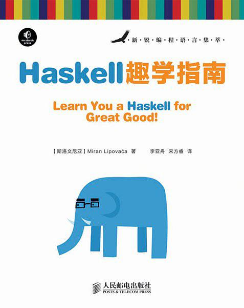

先放上我个人认为很帅的图标：

谈到Haskell，当时我只是在网上偶然看到函数式编程，便起了兴趣，想去了解一下，毕竟大学时间比较多，多了解一些东西也是好的。经过知乎上一番搜索，最后是选择了Haskell来了解函数式语言，因为它比较**纯**（然而我现在也没接触过其他函数式语言，Lisp，Scala等，也不太懂到底怎么纯的……）。

既然想学，就要去搜一些Haskell的学习资料啦，现在让我来推荐的话，《Learn You a Haskell for Great Good!》、《Haskell WikiBook》、《Real World Haskell》大概是这三本，然后做做[H-99: Ninety-Nine Haskell Problems](https://wiki.haskell.org/H-99:_Ninety-Nine_Haskell_Problems)就差不多入门了吧，然而我只看了第一本，初步领略了一下函数式编程的乐趣(?)就没再看了。

<!--more-->

说说这本书，当时大概看了两个星期吧，前面还好，基本语法还是能明白的，到了后面就很迷糊了。没错，说的就是你，**Monad**。Monad专业劝退想学Haskell的人，我当时为了了解这东西，网上到处搜啊，知乎上看看，结果到现在记得最清楚的反而是那句让人哭笑不得的话：

**一个单子（Monad）说白了不过就是自函子范畴上的一个幺半群而已。**

自函子我能懂，幺半群我也知道，可这两个东西加起来又能干什么呢，这东西到底有什么实际含义呢，直到后来看了一个[图解Monad](http://adit.io/posts/2013-04-17-functors,_applicatives,_and_monads_in_pictures.html)才略微理解了一点，让我真正觉得恍然大悟的是《Haskell WikiBook》的[Haskell/Category theory](https://en.wikibooks.org/wiki/Haskell/Category_theory)，只有真正和范畴论结合在一起，才能深入理解Monad这东西。

那么我为什么又说我对Haskell有执念呢，因为今天我无意间看到了JS的回调地狱，忽然间就想到自己弃坑的Haskell，当时看到网上说，Monad这东西是可以优雅解决这个问题的，现在想想，Haskell通过高度抽象，把函数包了一层又一层，并有Functor、Applicative、Monad这些概念，就是为了**纯**，当然，也能优雅的解决一些过程式、面向对象语言的问题。于是自己仿佛又燃起了学习Haskell的热情，学习Haskell有一种学习数学的感觉，让我觉得还不错，但想了想马上就要实习生春招了，而自己意向方向的知识感觉还欠缺好多，便只好作罢。

从这件事反观一下，现在的时代节奏太快，人们未必能静下心来学一些东西，这几年算法大火，工资也高，学的人非常多，真正有技术的又有多少呢，当然更大了来说，整个IT都是这样，人们调侃说，嫌工资低，转行当程序员总没错，于是便进培训班培训培训，简历上吹吹牛，于是当个程序员，拿个还不错的工资。而我以后会不会也是如此，等到IT这行工资不行了，也转行去其它热门行业呢？

但愿自己以后不会盲目追逐，能静下心来学一些东西，深入学习技术，不只是Haskell，更是其它的无穷无尽的知识。也许我对Haskell的执念，不只是不愿做一个不懂Haskell的Haskell粉，更是对自己不要浮躁的警告吧，能够静下心来，不被名利所迷惑，有着追求，做自己真正想做的事。