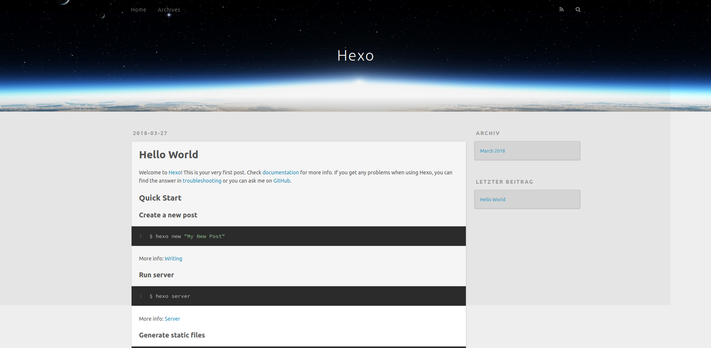
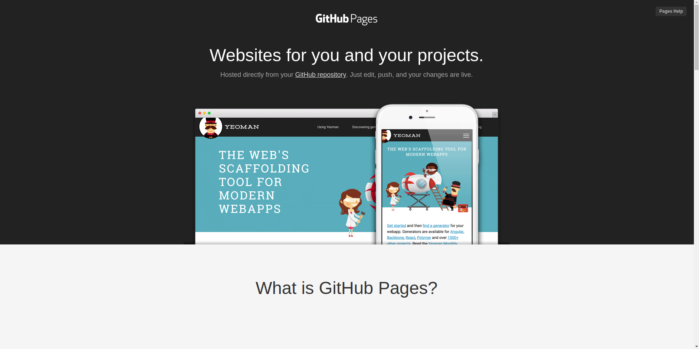
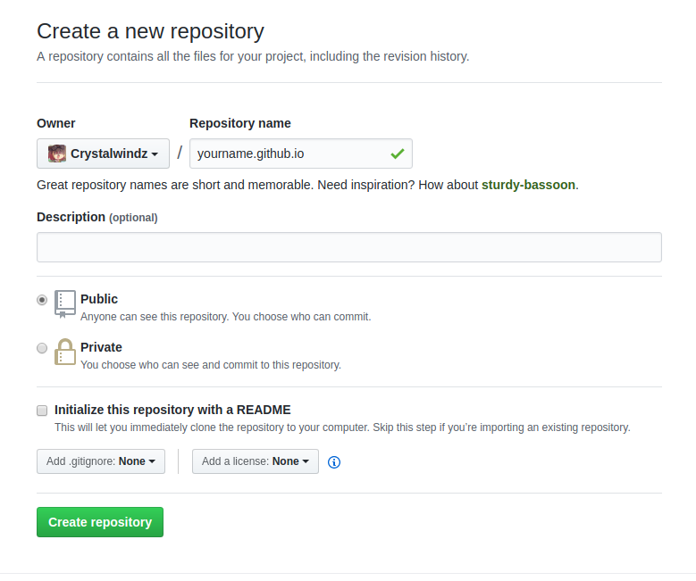
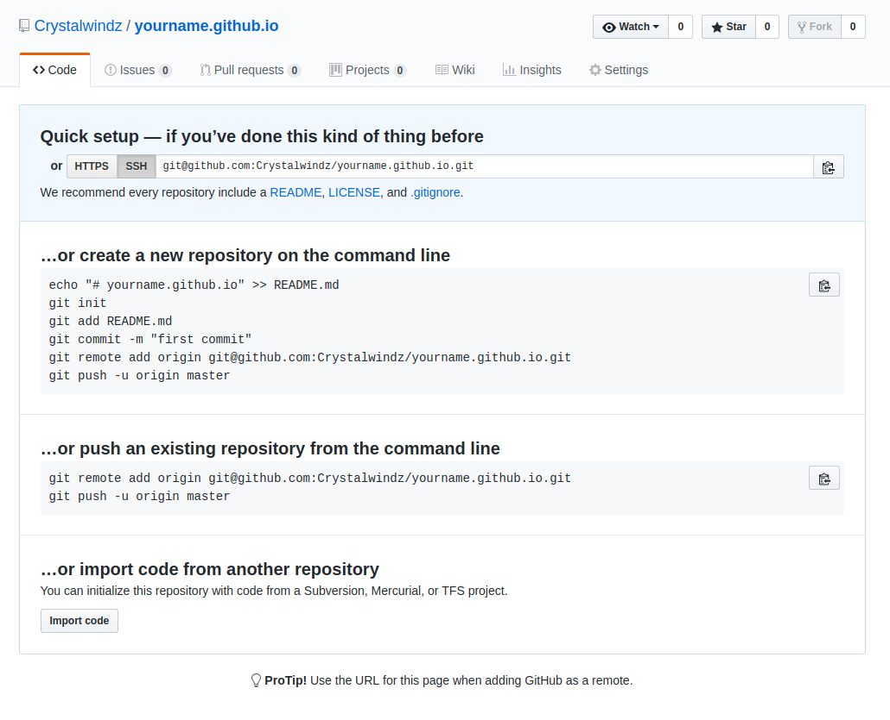
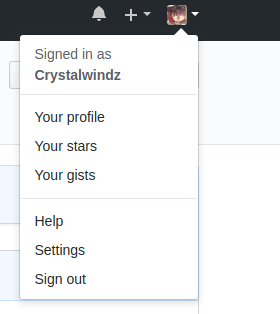
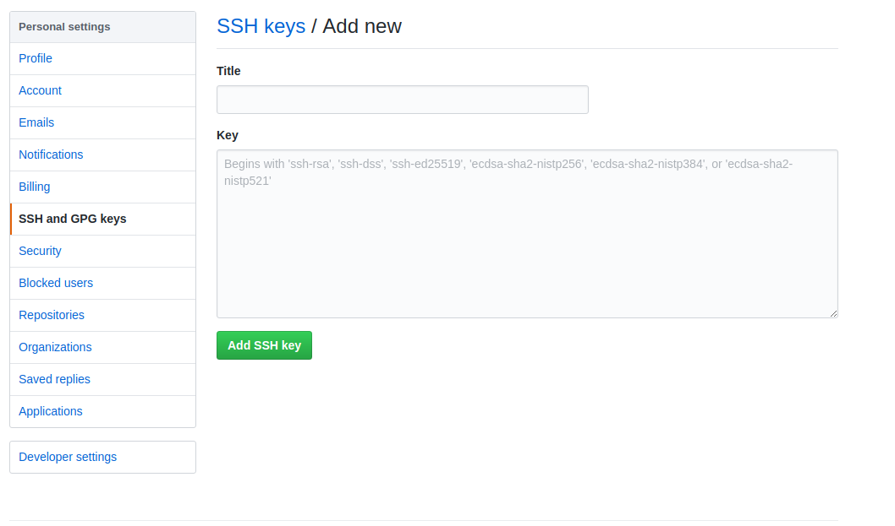

title: 利用Hexo和Github Pages搭建属于你自己的博客
categories:
  - 技术教程
tags:
  - 博客
  - 教程
date: 2018-03-26 23:17:10
---
## 环境说明
    系统：Ubuntu 16.04 LTS
    所需软件：Node.js、Git、Hexo

## 大致步骤
1. Node.js的安装
2. Git的安装和配置
3. Hexo的安装和配置
4. Github的配置
5. 博客的部署
5. 如何编辑和发布博客
6. 挑选一个Hexo主题

<!--more-->

## Node.js的安装
建议通过nvm(Node Version Manager)安装，nvm可以通过参照[nvm文档](https://github.com/creationix/nvm/blob/master/README.md)进行安装，这里直接给出安装方法：

* using cURL:
    ~~~shell
    curl -o- https://raw.githubusercontent.com/creationix/nvm/v0.33.8/install.sh | bash
    ~~~
* using Wget：
    ~~~shell
    wget -qO- https://raw.githubusercontent.com/creationix/nvm/v0.33.8/install.sh | bash
    ~~~

nvm安装后，如果终端提示找不到nvm命令，请使用source命令：
~~~
source ~/.bashrc
~~~
如果是zsh，请使用：
~~~
source ~/.zshrc
~~~
nvm安装完成后，运行
~~~
nvm install stable
~~~
安装Node.js，然后运行
~~~
node -v && npm -v
~~~
检查是否成功安装了Node.js和npm。

## Git的安装和配置

运行
~~~
sudo apt install git-core
~~~
即可安装git，然后对git进行简单配置：
~~~shell
git config --global user.name "yourname"
git config --global user.email "youremail"
~~~
然后生成ssh密钥：
~~~shell
ssh-keygen -t rsa
~~~
生成时它会让你选择密钥文件的存储位置以及让你设置密码，建议全部选择默认设置（全部直接回车下一步）

然后你的密钥就会存在~/.ssh这个文件夹里，里面应该有两个文件：id_rsa和id_rsa.pub，等会我们讲到Github Pages时会用到它们。

## Hexo的安装和配置

### 什么是Hexo？

Hexo是一个快速、简洁且高效的博客框架。Hexo使用Markdown或其他渲染引擎解析文章，在几秒内，即可利用靓丽的主题生成静态网页。

### Hexo的安装
运行
~~~
npm install hexo -g
~~~
安装hexo。运行
~~~
hexo -v
~~~
检查是否hexo安装好了，安装完成后，新建一个文件夹初始化自己的博客：
~~~
cd ~
mkdir Blog
cd Blog
hexo init
~~~
然后运行
~~~
npm install
~~~
npm会自动安装你需要的组件，等待它完成即可。

### Hexo简单体验

运行
~~~
hexo g
hexo s
~~~
然后点击终端中的链接 http://localhost:4000/ 来预览你所搭建的博客。

现在Hexo在本地的配置差不多结束了，接下来说明如何将Hexo和Github Pages联系起来，也就是让你的博客可以通过网络访问。

## Github的配置

### 什么是Github Pages？

[Github Pages](https://pages.github.com/)是Github提供给Github用户的一个静态页面，可以用来展示你个人、组织或项目的页面。

    GitHub Pages is a static site hosting service designed to host your personal, 
    organization, or project pages directly from a GitHub repository.

当然，你可以利用它来搭建属于自己的博客。

### 如何创建属于我的Github Pages？
官方提供了简单的教程 https://pages.github.com/

如果你对Github有所了解，你可以按照官方的教程创建，当然，你也可以按照我下面说的做：

首先，注册一个Github账号，不多说，然后点击主页右方的：

然后会出现这个页面，yourname请替换为你的github用户名：

这个yourname.github.io就是你博客的域名，然后应该会出现：

这就意味着你成功创建了属于你的repository。

然后点击右上角Settings：

点击SSH and GPG keys，再点击New SSH key，进入如下页面：

在终端运行：
~~~shell
cat ~/.ssh/id_rsa.pub
~~~
复制那一长串像乱码的东西，将他们粘贴到刚才的Add new页面，添加新的SSH key。

Github方面的配置已经差不多了。

## 博客的部署

回到刚才你Hexo初始化的博客那里，教程里为~/Blog。

终端进入该文件夹，然后运行：
~~~shell
npm install hexo-deployer-git --save
~~~
安装完成后，打开_config.yml文件，找到Deployment，按照如下进行修改，请将yourname替换为你的Github用户名：

    deploy:
      type: git
      repo: git@github.com:yourname/yourname.github.io.git
      branch: master

保存文件，然后在终端运行：
~~~shell
hexo g
hexo deploy
~~~
就可以将你的博客部署到Github page上去了，稍等片刻，在浏览器中访问yourname.github.io就可以看到你的博客了。

## 如何编辑和发布博客

进入你博客的本地文件夹，想新建一篇博客，运行：
~~~shell
hexo new title
~~~
然后你就可以在/source/_posts下面找到你的博客文件，文件格式为Markdown，利用Markdown编辑博客即可。

博客编写完成后，进行博客的生成和部署：
~~~shell
hexo g
hexo d
~~~
然后稍等片刻，访问你的博客地址，你就可以看到你刚才写的博客了，当然你也可以在发布之前，运行：
~~~shell
hexo s
~~~
在本地预览博客发布后的页面。

更多细节，请访问[Hexo文档](https://hexo.io/zh-cn/docs/writing.html)。

## 挑选一个Hexo主题

想让你的博客变得更好看？你可以访问[官方主题市场](https://hexo.io/themes/)或者从github上获取主题，我选择的主题是[Melody](https://github.com/Molunerfinn/hexo-theme-melody)，这个主题提供了详细的主题配置文档，你可以按照文档来配置属于你的博客。

