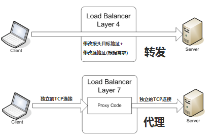
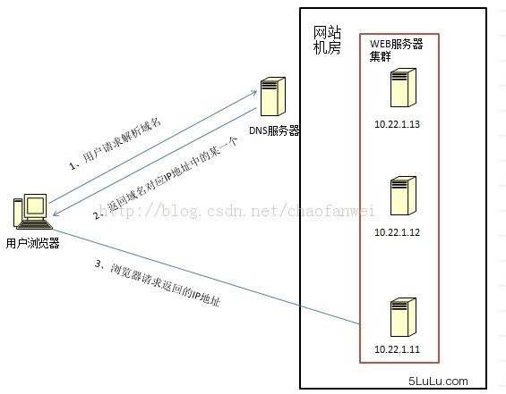
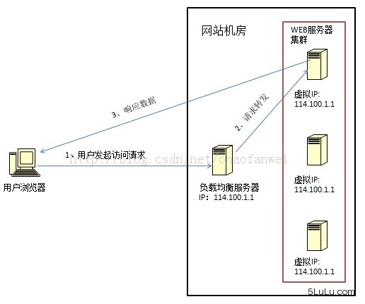
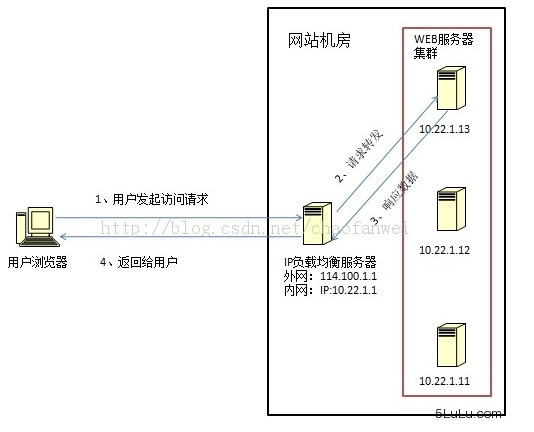
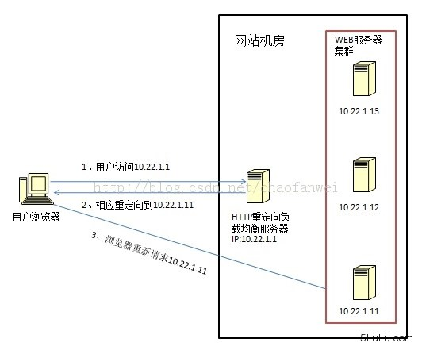
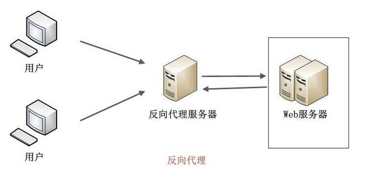

## 什么是负载均衡

我们都知道，当我们上网时，服务器无时无刻工作着，为我们提供服务。随着互联网的发展，业务流量越来越大且业务逻辑越来越复杂，单机服务器的性能已无法满足业务要求，为此，我们需要多台服务器进行性能的水平拓展，但如何平均地将流量分发到多台服务器上呢？这就是负载均衡。

## 负载均衡的方法

负载均衡整体上分为两大类：

* 四层负载均衡：在OSI的前四层进行负载均衡，根据报文的目的地址和端口号，决定提供服务的服务器；
* 七层负载均衡：在OSI的整七层进行负载均衡，主要是在应用层，通过报文中的内容来决定提供服务的服务器；

<!--more-->

两者的区别：

* 七层负载均衡因为要和客户建立连接，并分析报文内容，效率肯定低于仅起到一个转发作用的四层负载均衡；
* 七层负载均衡类似一个代理服务器，除了负载均衡之外，还可以起到缓存、保护的作用，使得应用系统更加灵活，而四层负载均衡只起到了类似路由转发的作用；

## 负载均衡的算法

1. 随机算法

    随机分配，按照权重设置随机概率，调用量越大分布越均匀，按照概率设置权重后也比较均匀，且便于动态调整权重。

2. 轮询和加权轮询

    若服务器处理能力相同，业务处理量差距不大，可轮询。

    如果服务器处理能力有差异，应根据相应的处理能力赋予服务器权重，让处理能力强的服务器处理更多的业务。

3. 最少连接和加权最少连接

    最少连接：始终与处理连接数最少的服务器进行通信。

    加权最少连接：若服务器处理能力不同，为每台服务器赋予权重，根据权重分配连接。

4. 哈希算法

    普通哈希或一致性哈希，一致性哈希更好，可防止某台服务器挂掉导致的波动。

5. IP地址散列

    管理发送方IP和目标方IP的散列，将来自同一发送方的分组转发到相同服务器。当客户端有一系列业务需要处理而必须和一个服务器反复通信时，该算法能够保证来自相同客户端的通信能够一直在同一服务器中进行处理。

6. URL散列
   
   根据请求URL信息的散列，将发送到相同URL的请求转发到同一服务器。

## 负载均衡具体实现（DNS->数据链路层->IP->HTTP）

1. DNS域名解析负载均衡(延迟)

通过在DNS服务器中配置多个A记录，每次域名解析都根据负载均衡算法返回一个不同的IP地址返回，使得A记录中所有的服务器构成一个集群，实现负载均衡。

优点是将负载均衡的工作交给了DNS，免去了网络管理，但由于DNS有缓存，当服务器集群发生变化时，网站可能暂时无法访问，且网站本身无法控制这种现象。

2. 数据链路层负载均衡(LVS)

通过在数据链路层修改mac地址进行负载均衡。这种方式并不修改IP地址，只修改mac地址，又称直接路由方式。

从图中可以看出，请求到达负载均衡服务器后，负载均衡服务器将目的mac地址更改为真正的服务器地址，服务器处理完数据可直接将相应数据发送给用户，这种数据传输方式称作三角传输模式。

3. IP负载均衡(SNAT)

通过在网络层修改目的地址进行负载均衡。当请求到达负载均衡服务器后，负载均衡服务器根据负载均衡算法修改IP地址，传送给真实服务器。

这种方法的关键是真实服务器如何将响应数据返回给用户，一种方式是负载均衡服务器在修改目的IP地址时同时修改源IP地址，另一种方式是将负载均衡服务器作为真实服务器的网关服务器。

优点是IP负载均衡在内核完成数据分发，性能较好，但由于所有的数据包都要经过负载均衡服务器，负载均衡服务器的性能将成为瓶颈。

4、HTTP重定向负载均衡(少见)

利用HTTP的302重定向响应让用户再次访问真正服务器。优点是简单，缺点是用户需要请求两次，效率太低，且HTTP重定向服务器处理能力可能成为瓶颈。

5、反向代理负载均衡(nginx)

也称应用层负载均衡。所有的请求都必须经过反向代理服务器，然后由反向代理服务器转发给真实服务器处理，反向服务器不仅可以进行负载均衡，还可以起到缓存加速的作用。优点是部署简单，缺点是反向代理服务器能力可能成为瓶颈。

**参考**

* [负载均衡算法及手段](https://segmentfault.com/a/1190000004492447)
* [负载均衡基础知识](https://www.cnblogs.com/danbing/p/7459224.html)