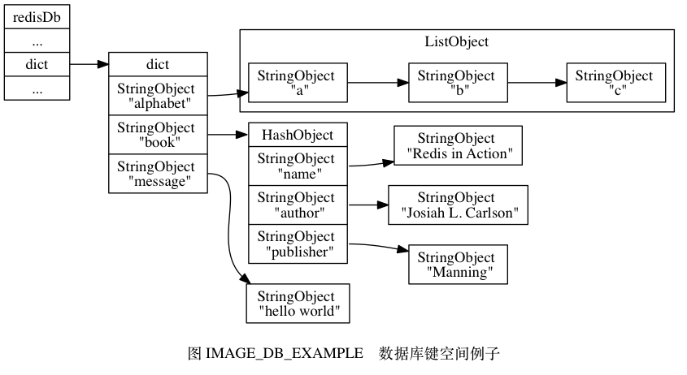

## 键空间

Redis是一个key-value数据库，RedisServer中有多个数据库，每个数据库都由一个redisDb结构表示，其中的dict字典保存了数据库中所有的键值对，dict称之为键空间：

* key就是数据库的键；
* value就是数据库的值，具体为字符串、列表、哈希、集合、有序集合中的一种；

假设这是一个现有的键空间：

添加键：
<!--more-->

删除键：

更新键：

获取键：

由于这个键空间包括了几乎所有的数据，很多针对数据库的命令都是对这个键空间进行处理来完成的。

## 键过期策略

和键空间类似，redisDb中的expires字典保存了所有设置了过期时间的键，这个过期字典中存着键的过期时间和键的引用，增删改查和键类似。

删除策略：

* 定时删除：利用定时器，准时删除键，然而对cpu时间不友好，不灵活，redis没有采用；
* 惰性删除：当获取一个过期的键时，才删除它，但会浪费内存；
* 定期删除：每隔一段时间就检查一遍过期字典，删除过期的键，但不好确定间隔时间；

Redis采用的后两种删除策略，在cpu时间和内存浪费之间努力平衡。

## 持久化

### RDB

RDB将内存数据存储在硬盘上，既可以手动执行，也可以让Redis定期自动执行，持久化的过程如下：

* BGSAVE：fork出一个子进程，然后子进程创建RDB文件，父进程继续处理请求；
* SAVE：阻塞服务进程直至创建RDB文件完成。

RDB的恢复会阻塞服务进程，直至恢复完成。

### AOF

AOF每次执行写命令就将写命令记录下来。具体过程：

* 服务器每执行一个写命令，就将这个写命令添加到一个缓冲区里；
* 根据设置的时间，定期将缓冲区写入硬盘；

AOF的恢复会创建一个伪客户端，由这个伪客户端执行保存的写命令来恢复。

AOF的重写：

* AOF重写可以降低AOF文件的冗余，听起来需要对现有的AOF文件进行处理，实际上根本用不到现有的AOF文件；
* AOF重写会直接读取当前数据库的键空间，根据里面的键值对来生成相应的写命令；

