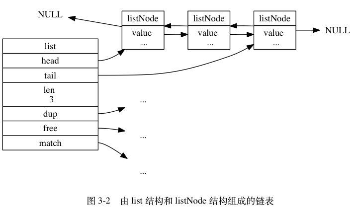
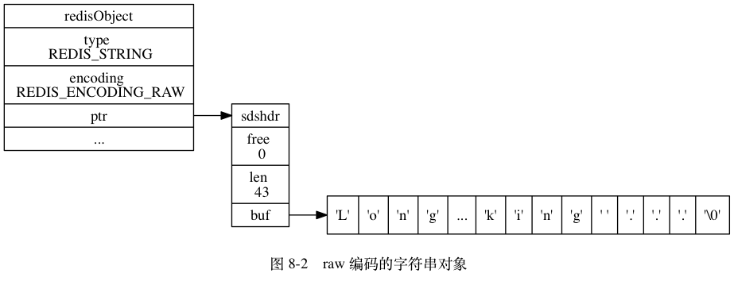
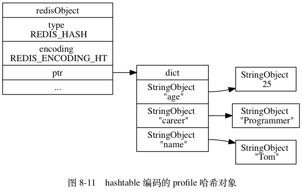
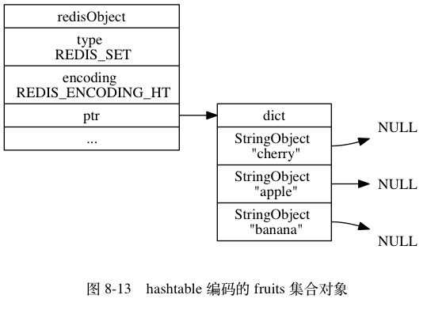

## SDS(简单动态字符串)

Redis只使用C字符串作为字面量，其他地方都使用SDS来表示字符串，定义如下：

~~~c
// 简单动态字符串
struct sdshdr {
    int len;   // buf已用字节数，也是字符串长度
    int free;  // buf未用字节数
    char buf[];// 保存字节的数组
};
~~~

* 
* SDS与C字符串类似，以'\0'结尾，但len不计'\0'的长度；
* SDS和C字符串相比：
  1. 有了len字段，可以常数时间获得字符串长度；
  2. 有了free字段，可以避免缓冲区溢出；
  3. 可以减少内存重分配的次数：
        1. 空间预分配：当需要扩展buf空间时，为buf分配额外的空间。修改后的len如果小于1MB，就分配和len相同大小的额外空间，大于1MB则分配1MB的额外空间；
        2. 惰性空间释放：当SDS长度缩短时，并不立刻回收内存，而是先用free记录空闲的空间，当必要时才释放空闲空间；
  4. 有了len字段，SDS也是二进制安全的，因为SDS使用len而不是'\0'来判断字符串结束；
  5. 由于SDS以'\0'结尾，所以兼容部分C字符串函数；
* 总结一下：

|C字符串|SDS|
|:---:|:---:|
| 获取strlen为O(N)                   | 获取strlen为O(1)                   |
| API不安全，缓冲区可能溢出          | API安全，缓冲区不会溢出            |
| 修改字符串N次必然需要N次内存重分配 | 修改字符串N次最多需要N次内存重分配 |
| 只能保存文本数据                   | 可以保存文本或二进制数据           |
| 可以使用所有\<string.h>函数        | 可以使用部分\<string.h>函数        |

<!--more-->

## 链表

Redis中链表使用很广泛，除了作为列表键的一种实现，发布与订阅、慢查询、监视器等都用到了链表，定义如下：

~~~c
// 链表节点
typedef struct listNode {
    struct listNode *prev;
    struct listNode *next;
    void *value;
} listNode;

// 链表
typedef struct list {
    listNode *head;
    listNode *tail;
    unsigned long len;
    void *(*dup) (void *ptr);// 节点复制函数
    void (*free) (void *ptr);// 节点释放函数
    int (*match) (void *ptr, void *key);// 节点比较函数
} list;
~~~
* 
* Redis的链表特点：
  * 双向链表；
  * 无环：表头的prev和表尾的next指向NULL；
  * 表头和表尾；
  * 表长度计数器；
  * 多态：listNode用void*保存节点值，然后设置dup, free, match函数即可实现多态；

## 字典

Redis使用字典作为底层实现，字典也是散列键的实现之一，定义如下：

~~~c
// 哈希表节点
typedef struct dictEntry {
    void *key; // 键
    union {
        void     *val;
        uint64_t u64;
        int64_t  s64;
    } v; // 值
    struct dictEntry *next; // 链地址法解决冲突
} dictEntry;

// 哈希表
typedef struct dictht {
    dictEntry **table;     // 哈希表数组
    unsigned long size;    // 哈希表大小，即table大小
    unsigned long sizemask;// 哈希表大小掩码，总等于size-1，用来计算索引值
    unsigned long used;    // 哈希表已有节点数量
} dictht;

// 字典
typedef struct dict {
    dictType *type; // 类型特定函数
    void *privdata; // 私有数据
    dictht ht[2];   // 哈希表
    int rehashidx; // rehash索引
} dict;

// 类型特定函数
typedef struct dictType {
    uint64_t (*hashFunction)(const void *key);// 计算哈希值
    void *(*keyDup)(void *privdata, const void *key);// 复制键
    void *(*valDup)(void *privdata, const void *obj);// 复制值
    int (*keyCompare)(void *privdata, const void *key1, const void *key2);// 比较键
    void (*keyDestructor)(void *privdata, void *key);// 销毁键
    void (*valDestructor)(void *privdata, void *obj);// 销毁值
} dictType;
~~~

* 
* 通过键值的void*类型，以及dictType的各种函数，字典实现了多态；
* Redis的哈希表使用链地址法解决哈希冲突；
* rehash相关的变量：
  * 通常只有ht[0]被使用，ht[1]只有在ht[0]进行rehash时才被使用；
  * rehashidx记录了rehash目前的进度，如果没有进行rehash则为-1；
* rehash全过程：
    1. 为ht[1]分配空间。如果要扩展哈希表，ht[1]大小为第一个不小于(ht[0].used*2)的(2^n)值；如果要缩小哈希表，ht[1]大小为第一个不小于(ht[0].used)的(2^n)值；
    2. 将保存在ht[0]上的所有键值对rehash(重新计算哈希值、索引值)到ht[1]上；
    3. 当ht[0]的所有键值对都迁移到ht[1]上后，释放ht[0]，并将ht[0]设置为ht[1]，然后设置ht[1]为空，为下一次rehash做准备；
* 是否rehash取决于服务器的状态和哈希表的负载因子；
* **由于哈希表的大小可能很大，rehash可能无法一次性完成，因此需要分多次进行渐进式rehash：**
    1. **为ht[1]分配空间，方法和之前一样；**
    2. **将索引计数器rehashidx设为0，表示rehash开始；**
    3. **在rehash期间，每次对字典进行增删改查操作时，都会顺带将ht[0]在rehashidx索引上的所有键值对rehash到ht[1]中，并++rehashidx；**
    4. **最终ht[0]中的所有键值对都会被rehash到ht[1]中，将rehashidx设为-1，释放ht[0]，ht[0]设置为ht[1]，ht[1]设为空，渐进式rehash完成；**
    5. **渐进式rehash过程中，删改查会在ht[0]，ht[1]两个表上进行，增只会作用在ht[1]上，保证rehash一定能完成；**

## 跳跃表

Redis只有有序集合键和集群节点用到了跳表，跳表实现简单，效率与平衡树也差不多，定义如下：

~~~c
// 跳跃表节点
typedef struct zskiplistNode {
    struct zskiplistLevel {
        struct zskiplistNode *forward;// 前进指针
        unsigned int span;            // 跨度
    } level[];                        // 层数组

    struct zskiplistNode *backward;   // 后退指针
    double score;                     // 分值
    robj   *obj;                      // 成员对象
} zskiplistNode;

// 跳跃表
typedef struct zskiplist {
    struct skiplistNode *header, *tail;// 表头表尾
    unsigned long length;              // 表中节点数量
    int           level;               // 表中节点最大层数
}zskiplist;
~~~

* 
* 一个跳跃表节点可以在多层出现，level数组存放了所有层的节点；
* span是一个节点的跨度，它是用来计算排位的（查找时累加跨度）；
* backward用来反向遍历跳跃表；
* 每个跳跃表中，score可以相同，但obj必须唯一；
* header、tail、length、level使得获取跳跃表的各种信息十分方便；

## 整数集合

Redis使用整数集合作为集合键的实现之一，这样可以节省内存，定义如下：

~~~c
// 整数集合
typedef struct intset {
    uint32_t encoding;  // 编码方式
    uint32_t length;    // 集合元素数量，即content的长度
    int8_t   contents[];// 元素数组
} intset;
~~~

* 
* 虽然contents声明为int8_t数组，但它的真正类型取决于encoding：
  * if encoding == INTSET_ENC_INT16: contents is int16_t[]；
  * if encoding == INTSET_ENC_INT32: contents is int32_t[]；
  * if encoding == INTSET_ENC_INT64: contents is int64_t[]；
* contents中的元素总是有序的；
* 向整数集合中添加新元素时，如果现有类型无法容纳新元素，整数集合会**升级：**
    1. 根据新元素类型，扩展contents空间大小，重分配空间；
    2. 扩展集合中原来所有元素的类型，并将它们放到正确位置；
    3. 将新元素添加到contents中；
* 升级带来的优点：
    1. 提高灵活性：集合中可以同时容纳int16_t, int32_t, int64_t；
    2. 节省内存：升级使得集合在有需要的时候才会扩展空间；
    3. 升级使得整数集合既能保存三种类型的值，又在必要时候才升级；
* **不存在降级操作**；

## 压缩列表

Redis使用压缩列表作为列表键和散列键的实现之一，压缩列表是为了节省内存开发的。压缩列表没有具体的结构体，实际用一个指针表示，指针指向内存布局类似这样：

* zlbytes: uint32_t，记录压缩列表的内存字节数；
* zltail:  uint32_t，记录表尾节点距压缩列表起始地址的偏移量；
* zllen:   uint16_t，记录压缩列表节点的数量；
* entryX:  类型不定，是压缩列表节点；
* zlend:   uint8_t，0xFF，标记压缩列表尾端；

接下来讨论一下entryX的构成：

* previous_entry_length: 记录前一个节点的长度，压缩列表利用它可以从表尾向表尾遍历；
* encoding: 记录content保存数据的类型和长度，通过不同的特定编码来表示；
* content: 节点的实际内容，由encoding决定其类型和长度；

## 对象

Redis构建了一个对象系统，对象系统中有五种对象：字符串、列表、哈希、集合、有序集合，每种对象都有多种实现方式，每种实现方式都用到了上面介绍的数据结构。下面介绍这个对象系统：

~~~c
// redis对象
typedef struct redisObject {
    unsigned type:4;// 类型
    unsigned encoding:4;// 编码
    unsigned lru:LRU_BITS; /* LRU time (relative to global lru_clock) or
                            * LFU data (least significant 8 bits frequency
                            * and most significant 16 bits access time). */
    int refcount;// 引用计数
    void *ptr;// 指向底层实现数据结构指针
} robj;
~~~

* 在Redis中创建一个键值对会创建两个对象，一个是键，一个是值；
* type: 记录对象的类型，Redis根据这个字段判断一个给定的命令是否能应用到一个对象上，TYPE命令也依赖于这个字段：
  * REDIS_STRING: 字符串
  * REDIS_LIST: 列表
  * REDIS_HASH: 哈希
  * REDIS_SET: 集合
  * RESID_ZSET: 有序集合
* encoding和ptr: 记录对象的底层实现数据结构，编码可以为：
  * REDIS_ENCODING_INT: long类型的整数
  * REDIS_ENCODING_EMBSTR: embstr编码的简单动态字符串
  * REDIS_ENCODING_RAW: 简单动态字符串
  * REDIS_ENCODING_HT: 字典
  * REDIS_ENCODING_LINKEDLIST: 双端链表
  * REDIS_ENCODING_ZIPLIST: 压缩列表
  * REDIS_ENCODING_INTSET: 整数集合
  * REDIS_ENCODING_SKIPLIST: 跳跃表和字典
* 每种对象都使用了多种编码，对应关系：

|类型|编码|对象|
|:---|:---|:---|
|REDIS_STRING|REDIS_ENCODING_INT|使用整数值实现的字符串对象。|
|REDIS_STRING|REDIS_ENCODING_EMBSTR|使用 embstr 编码的简单动态字符串实现的符串对象。|
|REDIS_STRING|REDIS_ENCODING_RAW	|使用简单动态字符串实现的字符串对象。|
|REDIS_LIST|REDIS_ENCODING_ZIPLIST	|使用压缩列表实现的列表对象。|
|REDIS_LIST|REDIS_ENCODING_LINKEDLIST	|使用双端链表实现的列表对象。|
|REDIS_HASH	|REDIS_ENCODING_ZIPLIST	|使用压缩列表实现的哈希对象。|
|REDIS_HASH	|REDIS_ENCODING_HT	|使用字典实现的哈希对象。|
|REDIS_SET	|REDIS_ENCODING_INTSET	|使用整数集合实现的集合对象。|
|REDIS_SET	|REDIS_ENCODING_HT	|使用字典实现的集合对象。|
|REDIS_ZSET	|REDIS_ENCODING_ZIPLIST	|使用压缩列表实现的有序集合对象。|
|REDIS_ZSET	|REDIS_ENCODING_SKIPLIST	|使用跳跃表和字典实现的有序集合对象|

* 字符串对象:   
    
    
    
* 列表对象：  
    
    
* 哈希对象：  
    
    
     
* 集合对象：  
    
    
* 有序集合对象：  
    
    
    
    
* 虽然Redis是C写的，但它的整个对象系统能根据type字段进行类型检查，根据type和encoding字段实现多态。
* refcount：记录对象的引用计数，实现了对象之间的共享，节省内存，提高效率；
* lru：记录对象的LRU时间或LFU数据；