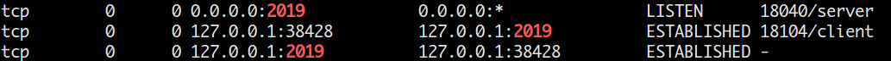
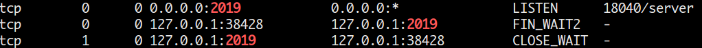
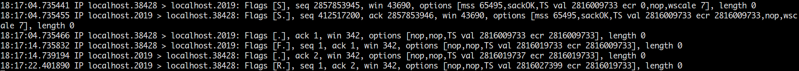
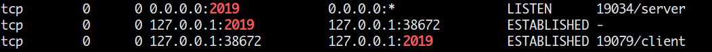
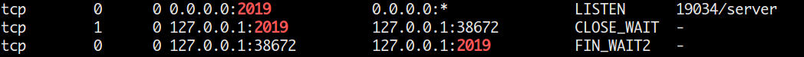
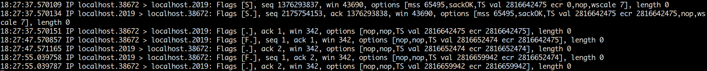
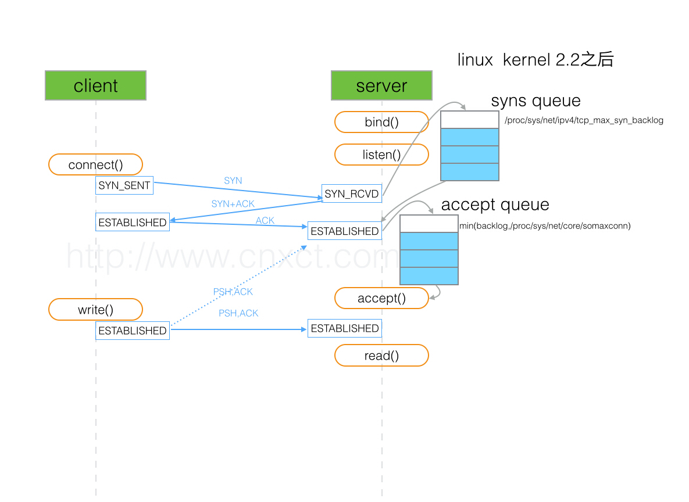
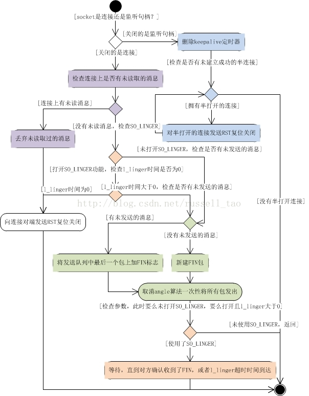
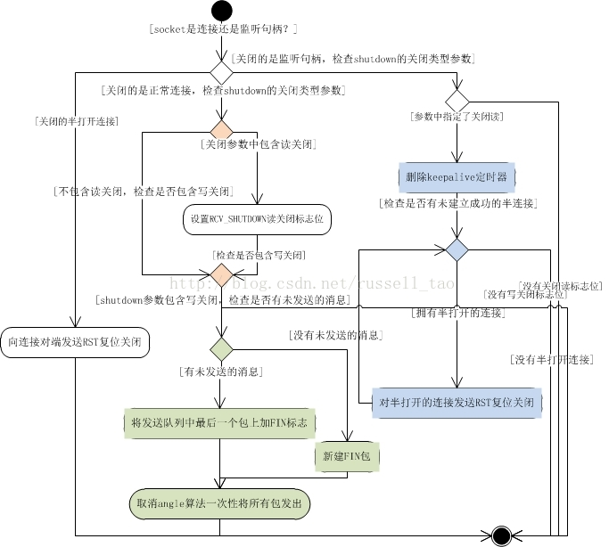

    服务器端创建一个socket，然后listen之后sleep，如果在sleep期间，有客户端connect服务器，服务器是否会醒来？或者怎样？

让我们来做个实验，代码如下(使用windz网络库)：

~~~c++
// server.cpp
int main(int argc, char **argv)
{
    Socket sockfd(socket(AF_INET, SOCK_STREAM, 0));
    sockfd.Bind(InetAddr(2019));
    sockfd.Listen();
    sleep(20);
}

// client.cpp
int main(int argc, char **argv)
{
    Socket sockfd(socket(AF_INET, SOCK_STREAM, 0));
    sockfd.Connect(InetAddr("127.0.0.1", 2019));
    sleep(10);
}
~~~

<!--more-->

开两个终端，使用tcpdump抓包和netstat观察状态：

~~~shell
sudo tcpdump -i lo port 2019
netstat -natp | grep 2019
~~~

结果如下：

以此来看，server并不会被唤醒，并且我们知道，一个进程结束时是会关闭它打开的所有fd的，而这里就是关闭socket，对应的就是前两次挥手，客户 sleep 10s，之后关闭，进行第一次挥手，服务器那边则是因为没有accept，直接发送RST终止连接。如果我们在服务器那边添加accpet的话，结果如下：

可看出进行的正常的四次挥手。

那么这些现象涉及到的底层原理有什么呢，简单总结一下：

* 全连接队列和半连接队列
   
    

    每个listen socket有两个队列，就是全连接队列和半连接队列，server收到client的syn后，把连接信息放入syns queue，并回复SYN+ACK，之后收到ACK就从syns queue中拿出队列放入accept queue。

* TCP连接的关闭细节

    

细节都在上面那两张图了。

* 其他的需要思考的地方

    * 为何第一次握手的序列号是随机的？
   
        * 首先，如果每个TCP连接的序列号都从1开始的话，那么如果某个序列号为1的报文因为网络原因延迟，然后这个报文过了很久，在新的连接中又出现，服务器是无法区分的。对于不同的连接，应该避免这种情况，而对于同一个连接的两个不同实例，这会导致数据混乱，是更加严重的；
        * 其次，从另一方面来讲，这也是TCP的一个缺陷，如果选择合适的IP地址，端口号，序列号，就可以伪造一个TCP连接中的数据包，进而攻击正常的连接，那么采用随机的初始序列号就能让攻击者难以猜出序列号。

    * 关于netstat的输出
   
        可以看到Program一列有时候是-，按照前面的分析，可以知道此时这个连接不属于任何进程，这也能一定程度上加深对两个队列的理解：除非你调用accept，否则一个ESTABLISH的连接是不属于任何进程的。

参考资料：

1. [TCP SOCKET中backlog参数的用途是什么？](http://www.cnxct.com/something-about-phpfpm-s-backlog/)
2. [TCP 三次握手原理，你真的理解吗？](https://mp.weixin.qq.com/s?__biz=MzIzOTU0NTQ0MA==&mid=2247487779&idx=1&sn=0980243dcec05c5df8e2e60937c2c5ed&chksm=e9292c2cde5ea53a7b309e3575c78940a378b358292a3badb828d6c9bb6e8d3997800564b1d5&mpshare=1&scene=23&srcid=0705cNzStWAzvxd5GzatiiNZ#rd)
3. [高性能网络编程4--TCP连接的关闭](https://blog.csdn.net/russell_tao/article/details/13092727)