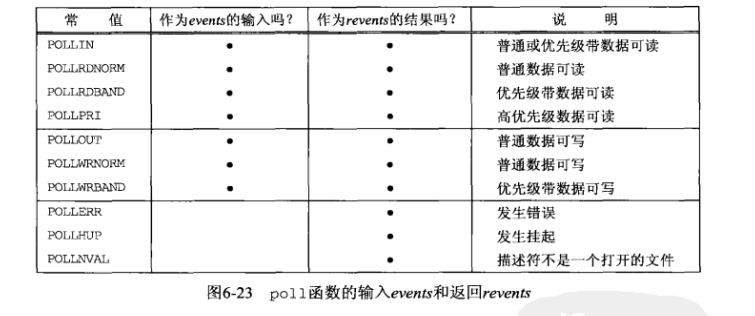

既然意向是后台开发，理应看看网络编程相关的书籍，这方面经典书籍应该就是UNP了，花了一个多星期时间看完了前两部分，感觉上手不难，但是知识比较杂，底层API比较多，有很多坑要注意，所以先总结一下，注意，**略过了SCTP相关内容**。

## 第一章 本书简介

这一章简单介绍了一下网络编程，并用timeclient和timeserver程序引入了后面要讲的基本知识，然后介绍了一些历史和标准，本书的示例等等。  

值得学习的是包裹函数的思想，将可能发生错误的函数用另一个函数包起来，并在这个函数里处理那个函数可能发生的错误，可以一定程度上简化程序的编写，并且也有利于程序的维护。  

习题里提到一点，不同TCP对数据的处理是不同的，应当做好把数据看做字节流来处理的准备，直至到达数据流末尾。

<!--more-->

## 第二章 传输层介绍

这一章讲了TCP/IP协议的相关内容，比较重要的是理解三次握手四次挥手的全过程，每个状态之间的转换以及存在的意义，注意TIME_WAIT存在的意义：

* 可靠地实现TCP全双工连接的终止：被动关闭的一方可能收不到主动关闭一方最后发送的ACK，因此一定是主动关闭的一方需要TIME_WAIT，以便重传最后那个ACK。
* 让本连接的所有网络分节全部消逝：TIME_WAIT的时间是2MSL，这个时间里能保证当前连接的所有分组都被丢弃，这样建立新连接时，就不可能接受到前一个连接的重复分组了。

随后是端口号，并发(fork相关)，缓冲区，常用网络服务与协议的关系。


## 第三章 套接字编程简介

这一章主要介绍的是套接字地址结构，字节排序函数，地址转换函数。

### 地址结构：

* 通用：
    ~~~c++
    struct sockaddr{
        uint8_t        sa_len;     // 并非所有系统都有
        sa_family_t    sa_family;  // 协议族
        char           sa_data[14];// 特定协议族数据
    };
    ~~~
* IPv4：
    ~~~c++
    struct in_addr{                // 这个结构是历史遗留问题 
        in_addr_t  s_addr;         // 地址
    };

    struct sockaddr_in{
        uint8_t        sin_len;    // 并非所有系统都有
        sa_family_t    sin_family; // 协议族
        in_port_t      sin_port;   // 端口号
        struct in_addr sin_addr;   // 地址结构
        char           sin_zero[8];// 填充struct sockaddr
    };
    ~~~
* IPv6：
    ~~~c++
    struct in6_addr{                  // 这个结构是历史遗留问题 
        unit8_t  s6_addr[16];          // 地址
    };

    struct sockaddr_in{
        uint8_t         sin6_len;     // 并非所有系统都有
        sa_family_t     sin6_family;  // 协议族
        in_port_t       sin6_port;    // 端口号
        uint32_t        sin6_flowinfo;// 流标字段
        struct in6_addr sin6_addr;    // 地址结构
        uint32_t        sin6_scope_id;// 范围
    };
    ~~~
* 新通用：
    ~~~c++
    struct sockaddr_storage{
        uint8_t         ss_len;        // 并非所有系统都有
        sa_family_t     ss_family;     // 协议族
        ...
        //满足对齐要求并且足够大能容纳系统支持的任何套接字地址结构
        //对用户透明，我查看了我的系统，这部分是这样写的:
        // #define __ss_aligntype  unsigned long int
        // #define _SS_PADSIZE \
        //   (_SS_SIZE - __SOCKADDR_COMMON_SIZE - sizeof (__ss_aligntype))
        // 
        // struct sockaddr_storage{
        //       __SOCKADDR_COMMON (ss_);    /* Address family, etc.  */
        //       char __ss_padding[_SS_PADSIZE];
        //       __ss_aligntype __ss_align;  /* Force desired alignment.  */
        //  };
        // 实际上__SOCKADDR_COMMON宏里只有一个family成员，
        // 也就是说我的系统并没有len这个成员
    }
    ~~~

比较一下：


### 值-结果参数：

就是传入当做值，传出当做结果的变量，因为需要更改变量，要传指针。

### 字节排序函数：

注意小端字节序和大端字节序的区别，网络字节序总是大端字节序的，而主机字节序未知，所以需要字节排序函数：

~~~c++
// h: host  n: network
// s: short l: long
uint16_t htons(uint16_t);
uint32_t htonl(uint32_t);
unit16_t ntohs(uint16_t);
uint32_t ntohl(uint32_t);
~~~

### 字节操纵函数：

和memset, memcpy, memcmp函数类似，**两者参数顺序不同**，**请注意**。

```c++
void bzero(void *dest, size_t nbytes);
void bcopy(const void *src, void *dest, sizr_t nbytes);
// 相等返回1，否则非零
int bcmp(cont void *ptr1, const void *ptr2, size_t nbytes);
```

### 地址转换函数

```c++
//下面三个函数只支持IPv4：

// 字符串有效返回1，否则0，结果存入addrptr指向结构中
int inet_aton(const char *strptr, struct in_addr *addrptr);

// 坑：出错返回INADDR_NONE，因此255.255.255.255不能由该函数处理，
// 然而这个函数已被废弃，不应使用
in_addr_t inet_addr(const char *strptr);

// 坑：返回指向静态内存字符串的指针，不可重入，
// 并且参数不是指针是结构……
char *inet_ntoa(struct in_addr inaddr);

// 下面两个函数IPv4, IPv6都支持，建议使用

// 成功返回1，str无效为0，出错为-1，addrptr指向in_addr或in6_addr结构
int inet_pton(int family, const char *strptr, void *addrptr);

// 和上面那个相反，注意最后给出存储单元大小，防止溢出缓冲区，
// len太小返回空指针，并设置errno=ENOSPC，成功返回strptr
const char *inet_ntop(int family, const void *addrptr, char *strptr, size_t len);
```

本书为了使代码与协议无关，编写了sock_ntop等相关函数，封装了inet_ntop和inet_pton等转换函数，也方便了代码编写。

### read和write函数

**坑：read和write函数不同于文件I/O, 输入输出字节数可能比请求数量少，但这不是出错，是因为缓冲区满的问题，需要多次调用read和write函数直至完成。** 为此本书编写了readn, writen, readline函数，然而从后面我们可以知道，readline函数要么调用很多次read导致速度很慢，要么使用缓冲区提高速度却增加了出现问题的可能（缓冲区是无法被select等函数所知道的，因此会一直阻塞）。

### 其他

仔细想想这些API，但凡涉及到指针的，大多都会多出一个参数要求你给出指针所指区域的大小，这是因为**仅凭指针是无法获知指针所指区域的大小的，为了安全，你就必须给出大小**，而有时候你又想要知道API究竟用了区域里多少空间，这时候就需要值-结果参数了。

## 第四章 基本TCP套接字编程


~~~c++
// family 协议族(AF_INET, AF_INET6, AF_LOCAL, AF_ROUTE, AF_KEY)
// type 套接字类型(SOCK_STREAM, SOCK_DGRAM, SOCK_SEQPACKET, SOCK_RAW)
// protocol 协议类型(IPPROTO_CP, IPPROTO_UDP, IPPROTO_SCTP, 0)
// family和type仅部分组合有效
// 创建套接字描述符
// 成功返回非负描述符，出错为-1
int socket(int family, int type, int protocol);

// 有关端口：
// TCP客户通常无需绑定端口，connect时内核会选择临时端口
// TCP服务器通过周知端口被人连接，应绑定端口
// TCP服务器若不绑定，listen时内核选择临时端口
// 有关IP地址：
// TCP客户若绑定IP地址必须是所在主机网络接口之一，且指派了IP数据报源IP地址
// TCP客户若不绑定，则内核根据其外出网络接口自动绑定IP地址
// TCP服务器通常不绑定IP地址，内核将客户SYN的目的IP地址就作为服务器源IP地址
// TCP服务器若绑定，则意味着只接受目的IP地址为绑定IP地址的IP数据报（注意一下强端弱端系统模型）
// 成功返回0，出错为-1
// 坑：传递servaddr参数记得(struct sockaddr*)强制类型转换
int bind(int sockfd, const struct sockaddr *myaddr, socklen_t addrlen);

// 如之前说的，接受指针的函数通常需要一个长度参数
// 由TCP客户调用以连接TCP服务器
// 成功返回0，出错为-1
// 坑1：传递servaddr参数记得(struct sockaddr*)强制类型转换
// 坑2：connect失败后失败后sockfd不再可用，需close重新调用socket
int connect(int sockfd, const struct sockaddr *servaddr, socklen_t addrlen);

// 套接字默认为主动，listen转换为被动，也就是从CLOSE转换到LISTEN
// backlog 套接字排队最大个数
// 一个监听套接字有两个队列：
//   1. 未完成连接队列：每项对应一个SYN分节，正在三次握手，处于SYN_RCVD状态
//   2. 已完成连接队列：完成三次握手的客户队列，处于ESTABLISHED状态
// 坑：不想让客户连接请关闭套接字，将backlog设为0是没用的
// 成功返回0，出错为-1
int listen(int sockfd, int backlog);

// 由TCP服务器调用，从已完成连接队列头取下一个连接
// 坑1：传递cliaddr参数记得(struct sockaddr*)强制类型转换
// 坑2：addrlen是值-结果参数，记得传指针
// 对客户地址不感兴趣可设cliaddr和addrlen为NULL
// 成功返回非负描述符，出错为-1
// 坑3：回传的已连接描述符和之前的监听描述符不同
int accept(int sockfd, struct sockaddr *cliaddr, socklen_t *addrlen);

// 坑：描述符是引用计数的
// 成功返回0，错误为-1
int close(int sockfd);
~~~

fork和exec函数准备看APUE深入了解，同时深入学习UNIX环境编程。

简单分清迭代和并发服务器。

知道这两个函数：

~~~c++
// 获取和某个套接字关联的本地地址或外地地址
// 成功返回0，错误为-1
// 坑：addrlen是值-结果参数

int getsockname(int sockfd, struct sockaddr *localaddr, socklen_t *addrlen);
int getpeername(int sockfd, struct sockaddr *peeraddr, socklen_t *addrlen);
~~~

## 第五章 TCP程序示例

### 服务器的编程大概是：

1. socket获取套接字
2. bzero, 并设置服务器sockaddr参数
3. bind sockaddr
4. listen
5. accept获取已连接套接字
6. 处理客户请求

### 客户的编程大概是：

1. socket获取套接字
2. bzero，并设置要连接的sockaddr参数
3. connect
4. 和服务器交互

### 连接的正常关闭：

客户进程可以自己调用close(shutdown也可)将客户创建的套接字关闭或等自身被终止后由内核将客户创建的套接字关闭，然后客户TCP发送FIN至服务器，产生四次挥手的过程。

信号处理准备在APUE详细了解。

### 子进程：

子进程终止后会给父进程发送SIGCHLD信号并进入僵死状态，这是为了维护子进程的信息(PID, 终止状态，资源利用信息)供父进程使用，父进程必须调用：

~~~c++
// 返回子进程PID, statloc指向子进程终止状态
pid_t  wait(int *statloc);
pid_t  waitpid(pid_t pid, int *statloc, int options);
~~~

**坑：UNIX信号不排队，同时产生n个相同信号，对应的信号处理函数可能执行少于n次，那么在一个函数里调用单个wait可能无法正确处理子进程，正确做法应在循环里调用waitpid并指定WNOHANG使之在还有子进程运行时不阻塞，这里是无法调用wait的，因为如果有子进程仍在运行，你无法阻止wait阻塞。**

### 慢系统调用：

指可能永远都阻塞的系统调用，注意，**阻塞于慢系统调用时若被信号处理中断，此系统调用可能会返回EINTR错误，随后是坑：这个慢系统调用未必会自动重启，即使设置了SA_RESTART标志也未必（这个标志系统未必支持），那么如果保证移植性，请处理EINTR错误然后重启慢系统调用。**

### 非正常连接终止

1. 三次握手完成后，在服务器accept前，客户发送RST，会导致accpet出错，错误如何处理依赖于不同的实现:(
2. 服务器和客户建立连接后，若服务器进程终止，则服务器发送FIN到客户。
3. 服务器和客户建立连接后，若服务器主机崩溃，有两种可能：
    1. 服务器不重启，客户继续工作，就会发现对方没有回应(ETIMEOUT)，路由器聪明的话，则是目的地不可达(EHOSTUNREACH)。
    2. 服务器重启后，客户继续工作，然而服务器已丢失客户信息，收到客户数据后响应RST。
4. 服务器和客户建立连接后，若服务器关机，init进程会给所有进程发送SIGTERM信号预警，然后发送SIGKILL关闭所有其他进程，这样和2情况没什么差别。

### SIGPIPE信号

向已收到RST的套接字写时会产生这个信号，默认终止进程。

### 数据格式

跨越套接字传递二进制数据不好，因为主机字节序可能不同，解决方法：

* 把所有数据作为文本串传送
* 显式定义二进制格式，遵循这个格式传送数据，RPC通常采用这个技术。

## 第六章 IO复用

### IO模型：

1. 阻塞式IO：请求IO时进程阻塞，直至IO准备好。
2. 非阻塞式IO：请求IO时，若IO将阻塞进程，不将进程投入睡眠，而是返回错误。
3. IO复用：进程可阻塞在多个系统调用上。
4. 信号驱动式IO：IO准备好时内核发送SIGIO信号，进程不会阻塞。
5. 异步IO：告知内核启动操作，并在内核完成后通知进程。


### IO复用：

#### select:

~~~c++
// 有描述符就绪返回其数目，超时为0，出错为-1
int select(int maxfdp1, fd_set *readset, fd_set *writeset,
           fd_set *exceptset, const struct timeval *timeout);
~~~

* maxfdp1是待测试的**最大描述符加1**，描述符0,1,2...maxfdp1-1均被测试。
* readset, writeset, exceptset分别是让内核测试读写异常条件的描述符集：
    * 用FD_ZERO(fd_set *fdset)宏 **初始化** 。
    * **一定要用FD_ZERO初始化描述符集**。
    * FD_SET, FD_CLR设置要检查的描述符（位）。
    * FD_ISSET测试描述符是否满足条件。
    * 这三个参数均为 **值-结果参数** ，**每次重新调用select时，重新设置描述符。**
    * **每次重新调用select时，重新设置描述符。**
* timeout是超时：
    * 永远等待：设置为NULL。
    * 等待一段时间：设置timeval结构并传递。
    * 不等待：设置timeval为0，检查描述符后立刻返回（轮询）。
* **select有最大描述符限制**，通常为1024（我的电脑是）。
* 描述符就绪条件:  
  
  

#### pselect:

~~~c++
// 有描述符就绪返回其数目，超时为0，出错为-1
int pselect(int maxfdp1, fd_set *readset, fd_set *writeset,
           fd_set *exceptset, const struct timespec *timeout
           const sigset_t *sigmask);
~~~

和select差别：

1. 使用timespec结构；
2. 加了一个指向信号掩码的指针：没太看懂，需要看APUE。

#### poll:

~~~c++
// 有描述符就绪返回其数目，超时为0，出错为-1
int poll(struct pollfd *fdarray, unsigned long nfds, int timeout);
------------------------------------------------------------------
struct pollfd{
    int    fd;
    short  events;
    short  revents;
}
~~~

* fdarray指向一个pollfd结构数组的第一个元素。
* 关于pollfd结构：
    * fd设置描述符，设为-1表示忽略。
    * 测试条件由events指出，描述符状态由revents返回：

        

* nfds是fdarray数组中元素个数。
* timeout是单位为毫秒的正数：
    * INFTIM：永远等待。
    * 0：立刻返回，不阻塞进程。
    * \>0：等待指定毫秒。
* poll没有select大小的限制。

#### epoll:

~~~c++
// size仅提示内核所需的事件表大小，返回一个标识事件表的文件描述符
int epoll_create(int size);

// op 操作类型：EPOLL_CTL_ADD, EPOLL_CTL_MOD, EPOLL_CTL_DEL
// event 指定事件，结构体定义在下面
// 成功返回0，失败返回-1并设置errno
int epoll_ctl(int epfd, int op, int fd, struct epoll_event *event);

struct epoll_event{
    _uint32_t    events; // 事件类型
    epoll_data_t data;   // 用户数据
}

typedef union epoll_data{
    void      *ptr;
    int       fd;
    uint32_t  u32;
    uint64_t  u64;
} epoll_data_t;

// events 指向存放所有就绪事件数组的指针
// maxevents 指定最多监听多少个事件，必须大于0
// timeout 与poll的timeout参数相同
// 成功返回就绪fd个数，失败返回-1并设置erro
int epoll_wait(int epfd, struct epoll_event *events, 
               int maxevents, int timeout);
~~~

epoll是Linux特有的IO复用，是用一组函数完成IO复用的。

* 有关LT和ET模式：
    * LT 水平触发，默认工作模式，也是select和poll的工作模式。一个事件就绪后，每次调用epoll_wait都会通知这个事件，直到这个事件被处理。
    * ET 边沿触发。一个事件就绪后，无论它是否被处理，epoll_wait仅通知一次这个事件，除非它再次就绪。
    * 可看出ET能减少同一事件被触发的次数，效率高，但编程会复杂。
    * **使用ET模式的fd必须是非阻塞的。**
    * 并发程序中，应当注册EPOLLONESHOT事件，防止一个socket同时被多个进程（线程）操作，然后在处理完后，则应重置EPOLLONESHOT事件。

#### select, poll, epoll对比：


### shutdown：

#### 与close对比

1. close将描述符引用计数减一，直到0才关闭套接字。
2. close终止读写两个方向的连接，然而TCP是全双工的，即使停止写，不代表对方不发送数据，不代表自己不需要读。

#### 有关howto

~~~c++
// 成功返回0，出错为-1
int shutdown(int sockfd, int howto);
~~~

* SHUT_RD：关闭读，并丢弃接受缓冲区所有数据，之后接受的任何数据都会被确认，但随即被静静丢弃。
* SHUT_WR：关闭写，也就是半关闭，将发送缓冲区所有数据发送掉，然后发送TCP终止序列(FIN)。
* SHUT_RDWR：和调用前面两个各一次一样。

### 其他坑点：

* 混合使用stdio和select很不好，因为select不知道stdio的缓冲区，它只从read或write等系统调用的角度指出是否可读可写。

## 第七章 套接字选项

~~~c++
// 成功返回0，出错为-1
int getsockopt(int sockfd, int level, int optname, void *optval, socklen_t *optlen);
int setsockopt(int sockfd, int level, int optname, const void *optval, socklen_t optlen);
~~~

* level: 指定解释选项的代码。
* optname：选项名。
* optval，opvlen：选项值，不同的选项数据类型不同。
  
### 有关选项

分为两大基本类：

* 二元标志选项：非0启用，0禁用。
* 值选项。

### 通用套接字选项 SOL_SOCKET

* SO_BROADCAST：广播选项。
* SO_DEBUG：TCP支持，内核保留跟踪信息。
* SO_DONTROUTE：绕过正常路由机制。
* SO_ERROR：获取so_error值。
* **SO_KEEPALIVE：TCP内置心跳机制。**
* **SO_LINGER：指定close的操作：**
    ~~~c++
    struct linger {
        int  l_onoff;
        int  l_linger;
    };
    ~~~
    * (l_onoff == 0)：close为默认设置，立刻返回。

        

    * (l_onoff != 0 && l_linger == 0)：close时TCP直接发送RST终止连接。
    * (l_onoff != 0 && l_linger != 0)：套接字关闭时，内核等待一段时间，直到发送缓冲区所有数据均发送并被确认或时间超时，这种时候**一定要检查close的返回值，超时close返回EWOULDBLOCK错误且丢弃发送缓冲区残留数据。**

        
        

    * **注意：设置SO_LINGER后close成功返回只能表示发送的数据已被对端TCP确认，不能表示对端应用进程是否已读取数据，确认对端应用进程读取的方法：**
        * 调用shutdown(SHUT_WR)，等待对端的close：

            
        
        * 使用应用级确认：

            

    * shutdown和close比较： 

        

* SO_OOBINLINE：带外数据留在正常输入队列中。
* **SO_RCVBUF, SO_SNDBUF：发送(接受)缓冲区默认大小。坑：由于窗口大小是在连接时通过SYN分节交换，因此客户必须要在conncet前设置，服务器必须在listen前设置。**
* **SO_RCVLOWAT, SO_SNDLOWAT：可读可写条件最低要求。**
* **SO_RCVTIMEO, SO_SNDTIMEO：接受发送超时。**
* **SO_REUSEADDR, SO_REUSEPORT：所有TCP服务器都应该在bind之前设置SO_REUSEADDR这个选项，以便重启服务器。**
* SO_TYPE：返回套接字类型。
* SO_USELOOPBACK：适用于路由套接字。

### TCP套接字选项 IPPROTO_TCP

* TCP_MAXSEG：TCP最大分节大小(MSS)。
* TCP_NODELAY：是否禁用Nagle算法：
    
    * Nagle算法的目的是减少网络中的小分组，并常与ACK延迟算法联合使用，看图好理解：

        

    * 对于服务器不在反方向产生数据或客户用若干小片数据向服务器发送逻辑请求的情况下，Nagle算法和ACK延迟算法不适合。解决方法：
        * 使用writev。
        * 使用缓冲区，然后对缓冲区使用一次write。
        * 设置这个选项，不推荐。

### fcntl

~~~c++
// 成功返回取决于cmd，出错为-1
int fcntl(int fd, int cmd, .../* int arg */);

// 开启非阻塞IO
int flags;

if((flags = fcntl(fd, F_GETFL, 0)) < 0)
    err_sys("F_GETFL error");
flags |= O_NONBLOCK;
if(fcntl(fd, F_SETFL, flags) < 0 )
    err_sys("F_SETFL error");
~~~

### 其他

* 
 
    第一个客户调用setsockopt, bind, connect, 如果第二个客户在第一个客户bind和connect之间调用bind, 那么返回EADDRINUSE错误，然而只要第一个客户连接上对端以后，第二个客户的bind就会正常工作，所以应该在第二个客户返回EADDRINUSE后多调用几次bind。

## 第八章 基本UDP套接字编程


~~~c++
// 成功返回读(写)的字节数，出错为-1
// buff, nbytes 读写缓冲区以及大小
// from 数据报源地址，注意addrlen是值-结果参数
// to   数据报目的地址，注意后面是个整数
ssize_t recvfrom(int sockfd, void *buff, size_t nbytes, int flags,
                struct sockaddr *from, socklen_t *addrlen);
ssize_t sendto(int sockfd, const void *buff, size_t nbytes, int flags,
               const struct sockaddr *to, socklen_t addrlen);            
~~~

* 各种情况：
    * 数据报丢失：UDP数据包不可靠，很可能丢失。
    * 验证响应：不能让所有知道客户端口号的进程都能向客户发送数据报，客户程序应对接收到的数据报的源地址进行验证。
    * 服务器未运行：对一个UDP套接字，它引发的异步错误不会返回给它，除非它已连接。

* 小总结：
    
    
    

### 关于connect函数

connect后的UDP套接字有三个变化：

1. 写操作不能指定目的地址和端口了，因为connect时就已经确定。
2. 读操作也不用获取源地址了，因为此时套接字只会接受connect指定地址的数据报。
3. 异步错误会返回给它们所在的进程。

如果多次调用connect：

1. 要么是指定新的目的地址和端口。
2. 要么是要断开套接字(设置AF_UNSPEC)。

**如果向同一目的地址发送数据报，已连接UDP套接字的性能要好于未连接UDP套接字。**


### 其他

* 不论接受缓冲区接受到了多少数据，recvfrom永远都不会返回超过一个数据报的数据，这和TCP不同。

## 第十一章 名字地址转换

### 关于DNS：


### 相关函数

#### gethostbyname

~~~c++
// 成功为非空指针，出错为NULL并设置h_errno
struct hostent *gethostbyname(const char *hostname);
~~~

* hostent结构：
 
    

#### gethostbyaddr

~~~c++
// 成功为非空指针，出错为NULL并设置h_errno
struct hostent *gethostbyaddr(const char *addr, socklen_t len, int family);
~~~

* 通常关注h_name。
* addr实际上是struct in_addr*类型。
* family为AF_INET。
* hostent结构和gethostbyname一样。

#### getservbyname, getservbyport

~~~c++
// 成功为非空指针，出错为NULL并设置h_errno
struct servent *getservbyname(const char *servname, const char *protoname);
struct servent *getservbyport(int port, const char *protoname);

struct servent{
    char  *s_name;
    char **s_aliases;
    int    s_port;
    char  *s_proto;
};
~~~

* protoname可选，但注意有些端口(512, 513, 514)UDP和TCP提供的服务完全不同。
* **s_port, port都是网络字节序，所有不要对s_port调用htons，而在传参时要对port调用htons。**

#### getaddrinfo

~~~c++
// 成功返回0，出错为非0
int getaddrinfo(const char *hostname, const char *service,
            const struct addrinfo *hints, struct addrinfo **result);
~~~

* hints填入期待返回类型的提示：
    * ai_flags: AI_PASSIVE, AI_CANONNAME...
    * ai_family: AF_xxx
    * ai_socktype: SOCK_xxx
    * ai_protocol
* result指向一个指向addrinfo结构链表的指针：

    

#### gai_strerror

~~~c++
// 返回getaddrinfo返回的非0错误的含义
const char *gai_strerror(int error);
~~~

#### freeaddrinfo

~~~c++
// getaddrinfo返回的链表是动态申请的
// ai指向第一个addrinfo结构，释放这个链表占用的堆内存
void freeaddrinfo(struct addrinfo *ai);
~~~

#### getnameinfo

~~~c++
// 成功返回0，出错为非0
int getnameinfo(const struct sockaddr *sockaddr, socklen_t addrlen,
                char *host, socklen_t hostlen,
                char *serv, socklen_t servlen, int flags);
~~~

* sockaddr中包含待转换的协议地址。
* host，serv需预先分配内存并提供长度参数。
* 关于flags：

    

### 可重入函数

记一下，inet_pton, inet_ntop, getaddrinfo, getnameinfo通常可重入。

不可重入的原因是使用了全局变量或静态变量。

关于gethostbyname_r和gethostbyaddr_r, 这个是平台依赖的，我使用时比较坑……建议使用getaddrinfo和getnameinfo代替。

### 其他

网络相关信息有一系列函数：


