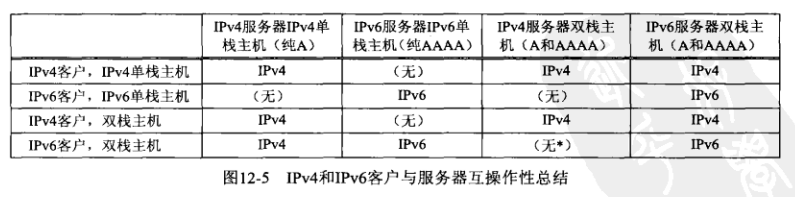
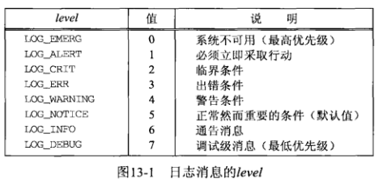
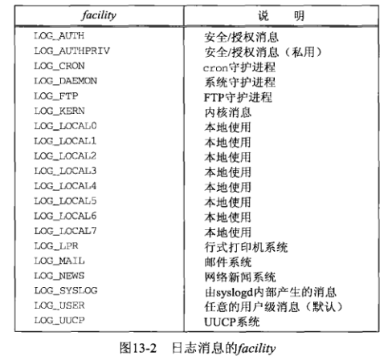
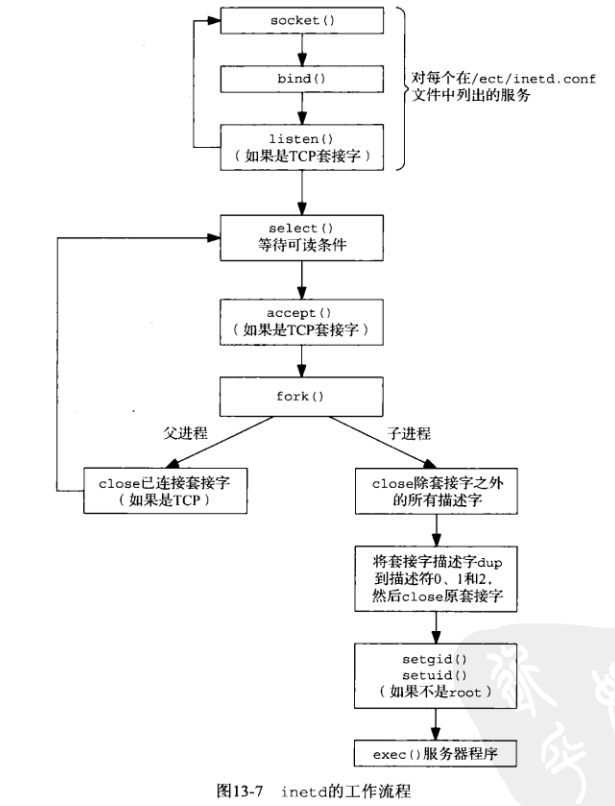
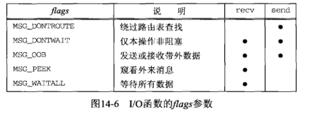
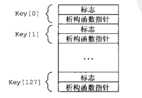
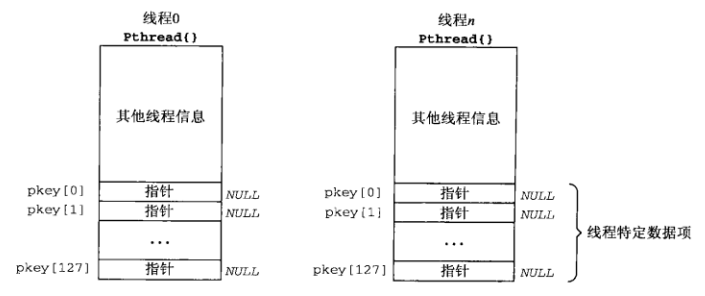
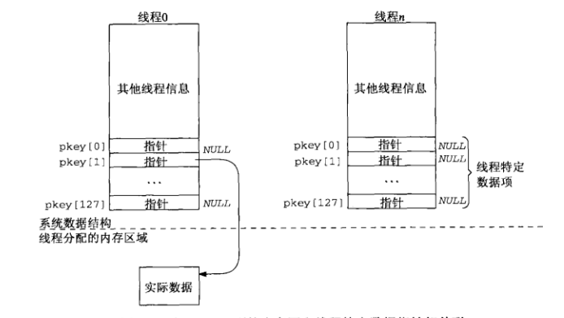

## 第十二章 IPv4和IPv6

一图解释：

## 第十三章 守护进程和inetd

守护进程：在后台运行且不与任何终端关联的进程。

syslogd：这个守护进程创建Unix域数据报套接字绑定/dev/log，等待接受日志信息，不过推荐使用syslog函数。

<!--more-->

~~~c++
void syslog(int priority, const char *message, ...);
~~~

* priority是以下两者位或：
 
  
  

* message类似printf。

关于daemon_init：

* fork，保证子进程后台运行且不是一个进程组的头进程；
* setsid，子进程变成新会话和新进程组的头进程；
* fork，保证子进程不会获得控制终端；
* 更改目录，关闭描述符，重定向描述符；
* 用syslogd处理错误。

关于inetd：

* 简化部分守护进程的编写；
* 单个进程取代每个服务一个进程，减少了进程总数；
* 读取/etc/inetd.conf配置；
* 

## 第十四章 高级I/O函数

### 如何设置I/O超时？

1. 调用alarm，通过SIGALRM中断系统调用；
2. 使用select提供的超时机制等待I/O，用于connect时要求非阻塞；
3. 使用SO_RCVTIMEO, SO_SNDTIMEO套接字选项。

### recv和send

~~~c++
ssize_t recv(int sockfd, void *buff, size_t nbytes, int flags);
ssize_t send(int sockfd, const void *buff, size_t nbytes, int flags);
~~~

比起read和write区别在flags上，如下：

### readv和writev

~~~c++
ssize_t  readv(int filedes, const struct iovec *iov, int iovcnt);
ssize_t writev(int filedes, const struct iovec *iov, int iovcnt);

struct iovec{
    void    *iov_base;
    size_t   iov_len;
}
~~~

分散读和集中写，iov是指向struct iovec的一个数组。

### recvmsg和sendmsg

~~~c++
ssize_t recvmsg(int sockfd, struct msghdr *msg, int flags);
ssize_t sendmsg(int sockfd, struct msghdr *msg, int flags);

struct msghdr{
    void           *msg_name;
    socklen_t      msg_namelen;
    struct iovec   *msg_iov;
    int            msg_iovlen;
    void           *msg_control;
    socklen_t      msg_controllen;
    int            msg_flags;
}
~~~

* msg_name, msg_namelen类似recvfrom, sendto的第五、六个参数；
* msg_iov, msg_iovlen类似readv, writev的第二、三个参数；
* 区别flags和msg_flags，两者在接受和发送中有所不同；

### 辅助数据

利用sendmsg, recvmsg中msghdr的msg_control, msg_controllen发送接受。

## 第十五章 Unix域协议

Why use it?

* 同一主机上比TCP快；
* 能传递描述符；
* 能提供额外的安全检查；

~~~c++
struct sockaddr_un{
    sa_family_t  sun_family; //AF_LOCAL
    char         sun_path[104];
}
~~~

* **路径必须是绝对路径名**；
* connect连接的路径名必须满足：
    * 存在该路径名；
    * 必须是一个套接字；
    * 有与之关联的打开的描述符；
    * 类型相符合；
* connect发现监听套接字队列满直接返回ECONNREFUSED错误，不会像TCP一样重试；
* 发送数据报必须手动绑定路径名，系统不会自动绑定路径名，否则接收端无法应答；

~~~c++
//创建两个连接的套接字，仅适用于Unix域套接字
int socketpair(int family, int type, int protocol, int sockfd[2]);
~~~

描述符传递：

1. 创建Unix域套接字；
2. 发送进程创建msghdr，在其中填上描述符，发送；
3. 接受进程利用recvmsg接受描述符；
   
**注意，描述符传递并不是传递描述符数值，而是在发送过程中创建一个新的描述符，这个新的描述符引用相同的文件表项，新描述符的数值和发送描述符数值没有任何关系。**

## 第十六章 非阻塞I/O

将一个套接字设置为非阻塞后，对其调用read, readv, recv, recvfrom, recvmsg, write, writev, send, sendto, sendmsg, accept若无法满足条件，进程不会睡眠，而是调用会返回一个EWOULDBLOCK，对于connect来说，连接通常无法立刻建立，但会激发三次握手，返回EINPROGRESS。

使用方法通常如下：

~~~c++
int val = fcntl(fd, F_GETFL, 0);
fcntl(fd, F_SETFL, val | O_NONBLOCK);
......
if( (n = func(fd, buff, bufflen)) < 0){
    if(errno == EWOULDBLOCK)
        continue;
    ......
}
~~~

### 非阻塞connect：

用途：

* 将三次握手的时间利用起来；
* 同时建立多个连接；
* 利用select缩短connect的超时；

注意：

* 非阻塞connect通常无法立刻完成，返回EINPROGRESS，但若是同一主机，连接通常立刻完成。
* 利用select如何判断connect成功是个问题：
    * 套接字可写不可读意味着connect成功；
    * 套接字可读可写意味着发生错误或者**连接成功且对端已发送数据，应当再判断一下errno。**
    * 移植问题（这里不考虑
* 如果非阻塞connect可能被中断，且connect不被重启，此时只能使用select判断connect是否成功，因为我们不能再次调用connect。

### 非阻塞accept：

若用select检测监听套接字的可读性(是否可accept)，既然select返回的是监听套接字可读，那么accept就不可能阻塞吗？答案是否定的，**如果在select返回和accept之间客户发送RST终止连接，则连接被移除已连接队列，这时服务器调用accept就会阻塞，为了避免这个问题，就应当在select之前把监听套接字设为非阻塞，并在之后的调用中注意这一点。**

## 第十七章 ioctl

ioctl是对设备I/O通道进行控制的函数。

## 第十八章 路由套接字

路由套接字可以管理路由表、接口列表，获取相关信息。

## 第二十章 广播

竞争状态的相关思考：

* 如果有多个进程访问共享数据，结果取决于进程的执行顺序，那么此时竞争问题就会出现；

## 第二十二章 高级UDP编程

* 只有UDP支持广播和多播；
* UDP连接成本小；
* UDP不可靠，无流量控制；
* 简单请求和应答可以使用UDP，但应用程序应当自行错误检测；

### UDP的可靠性

* 超时和重传
* 序列号

### 并发UDP服务器

* 如果UDP只发送一个应答，简单fork让子进程处理客户就好。
* 如果UDP和客户交换多个数据报，由于客户只知道服务器的众所周知端口，当主进程接受到一个数据报时不好判断数据报的来源，此时的解决办法是为每个客户创建一个新的套接字，并让客户将之后的数据包发送至这个新的套接字。

## 第二十四章 带外数据

TCP并没有真正的带外数据，不过提供了紧急模式，一些注意点：

* 收到的TCP首部虽然指出发送端进入紧急模式，但紧急指针指的数据却不一定已经发送；
* 即使因为流量控制暂停发送数据，紧急通知仍会发送；
* 每个连接只有一个带外标记，新到达的标记会覆盖之前的标记；
* 除非指定SO_OOBINLINE，新的带外字节会覆盖旧的带外字节；

## 第二十五章 信号驱动式I/O

* 设置SIGIO信号的信号处理函数；
* 设置套接字属主(fcntl F_SETOWN)；
* 开启信号驱动式I/O(fcntl F_SETFL)；

SIGIO信号的产生：

* 对于UDP：
    * 数据报到达；
    * 发生异步错误；
* 对于TCP：
    * 监听套接字连接请求完成；
    * 断连请求发起；
    * 断连请求完成；
    * 连接半关闭；
    * 数据到达；
    * 数据发送；
    * 发生异步错误；

信号处理函数无法判断套接字的情况，于是信号式I/O对于TCP基本没用，UDP还有点用，不过只是一点。

## 第二十六章 线程

线程可以理解为轻量进程，同一进程有多个线程，这些线程共享全局内存，也就是共享全局变量、描述符、信号处理函数、工作目录，但每个线程有各自的TID、寄存器、栈、errno、优先级。

### 创建和终止

~~~c++
//类似fork，attr是线程属性，func是函数指针，arg是函数参数
int pthread_create(pthread_t *tid, const pthread_attr_t *attr,
            void *(*func)(void *), void *arg);
//类似waitpid
int pthread_join(pthread_t *tid, void **status);
//类似getpid
pthread_t pthread_self(void);
//使线程脱离，类似守护进程
int pthread_detach(pthread_t tid);
//终止线程
void pthread_exit(void *status);
~~~

### 线程特定数据

* 每个线程支持有限数量的线程特定数据：

    

* 调用pthread_key_create创建一个键，并指定析构函数；
* 调用pthread_getspecific获取特定线程的键值(指针)；
  
    

* 分配所需内存，并将内存地址赋给指针；
    
    

* 线程终止时，扫描pkey数组，为非空元素调用key数组中相对应的析构函数；

### 互斥锁和条件变量

~~~c++
int pthread_mutex_init(phtread_mutex_t *mptr, const pthread_mutexattr_t *attr);
int pthread_mutex_destory(pthread_mutex_t *mptr);
int pthread_mutex_trylock(pthread_mutex_t *mptr);
int pthread_mutex_lock(pthread_mutex_t *mptr);
int pthread_mutex_unlock(pthread_mutex_t *mptr);
~~~

~~~c++
int pthread_cond_init(phtread_cond_t *cptr, const pthread_condattr_t *attr);
int pthread_cond_destory(pthread_cond_t *cptr);
int pthread_cond_wait(pthread_cond_t *cptr, pthread_mutex_t *mptr);
int pthread_cond_signal(pthread_cond_t *cptr);
int pthread_cond_broadcast(pthread_cond_t *cptr);
~~~

为什么条件变量必须关联一个互斥锁：

* 既然是条件变量，通常和一个变量有关，而这个变量肯定是共享的，因此这个变量肯定需要一个互斥锁；
* wait函数是原子操作，当它阻塞时，必须要解锁这个互斥锁，如果不传给wait函数互斥锁自己手动解锁互斥锁，就不是原子操作了；

## 第二十八章 原始套接字

原始套接字可以直接读取ICMP分组，可以处理内核不处理的协议字段的数据报，还可以自己构造数据报。

## 第三十章 C/S服务器程序设计范式

* 迭代服务器
* 并发服务器
    * 多进程
        * 有进程池
        * 无进程池
    * 多线程
        * 有线程池
        * 无线程池