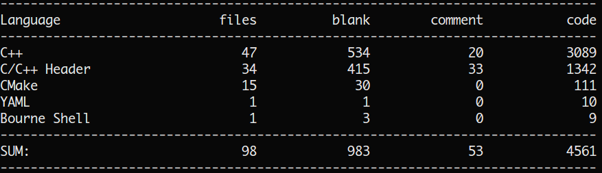

项目地址：[Crystalwindz/windz](https://github.com/Crystalwindz/windz)

经过一个半月的努力，windz库终于写完了。起初只是想做个Web服务器交课设，但这服务器越写越偏，越来越像一个网络库，于是就想，索性就写成网络库吧，都说C++程序员都喜欢造轮子，也许我也是。

一开始写Web服务器时，我也只是看过APUE、UNP，简单了解网络编程的人，实际写起来C++网络程序，也是相当困难，无从下手。万事开头难嘛，于是尝试在github上找找别人写的Web服务器，阅读源码来学习一下，有幸看到了[linyacool/WebServer](https://github.com/linyacool/WebServer)，readme写的相当详细，并大力推荐了陈硕的[chenshuo/muduo](https://github.com/chenshuo/muduo)和他的[Linux多线程服务端编程](https://book.douban.com/subject/20471211/)，我看到后当即就去学校图书馆借了一本。借来这本书，看到目录和书背上的一些问题，感觉无比痛快，我的疑问大部分都在上面有了详细的解答，上一次看书这么爽还是看Effective C++的时候。

于是便读了书，跟着书中的指引和源码，一步一步地把windz这个库写完了，通过读书和写这个库，我学到了太多太多：
<!--more-->
* 搞懂了Reactor模式：之前看过不少博客讲解Reactor模式，但都一知半解，以后要注意了，想学一些知识，不能只看理论知识，还是要落实到实际代码上去才能彻底搞懂；
* 熟悉了多线程编程和锁的使用：通过实际编写多线程的程序，能深刻体会到线程同步的困难和重要；
* 对内存控制，RAII理解更加深刻：muduo库中用到了enable_shared_from_this，shared_ptr, unique_ptr, weak_ptr，各种各样的智能指针，就算智能指针大大解决了内存泄露的问题，但实际用起来才会明白，不合理地使用智能指针，一样会造成内存泄漏(循环引用)，空悬指针(必须要严格遵守RAII，千万不要释放裸指针，所以也尽量使用make_shared, make_unique)等问题，至于enable_shared_from_this，想弄懂它的原理，更是要明白智能指针的实现细节——全局引用计数，weak_ptr和shared_ptr共享同一个全局引用计数；
* 知道了网络编程的各种细节：学过计算机网络，看过UNP，可到实际编写网络程序时才懂得基础是多么重要，三次握手四次挥手，socket，bind，listen，accept，connect，read，write，IO复用，每个环节都有各种各样要注意的细节，必须要理解每个参数的含义，返回值的含义，才能写出可靠的网络程序；
* 理解了代码规范的重要：整个windz总计4500多行，我全程按照Google C++规范编写，并注意了各种命名，头文件的包含顺序等，才能时刻清楚自己在写什么。4500行，感觉只能算是一个小数量的代码，我一个人单独编写，没有项目经验的我，勉强撑住了这次考验，也算是提高了阅读代码的能力。
* 熟悉一些工具：git，travis-ci，CMake，gdb，clang-format，CLion等；
* 其他的一些收获：踩踩C++本身的坑，学会测试自己的代码，conf文件规范，定时器的编写，熟悉Linux系统调用等。

整体来说，写windz是处于学习目的，写的仍有很多我没发现的缺陷，仍需努力:(

以cloc截图结尾吧:)

